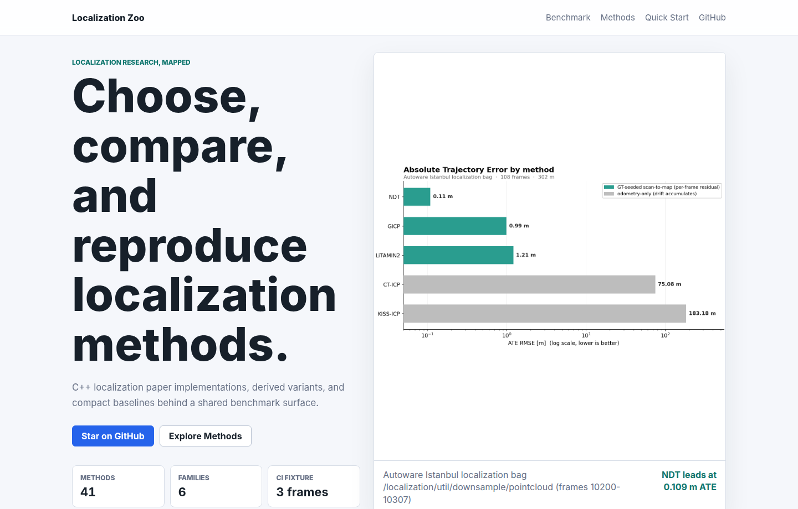

<div align="center">
  <h1 align="center">Localization Zoo</h1>
  <p align="center">
    <b>C++ implementations, derived variants, and compact baselines for localization papers</b>
  </p>
  <p align="center">
    
    
    
    
    
  </p>
  <p align="center">
    <a href="https://rsasaki0109.github.io/localization_zoo/"><b>Open the interactive benchmark and method explorer</b></a>
  </p>
  <p align="center">
    <a href="https://rsasaki0109.github.io/localization_zoo/">
      
    </a>
  </p>
</div>

---

## Why Localization Zoo?

Many localization papers do not ship reusable reference implementations.
This repository collects paper-oriented C++ implementations behind a unified API, with ROS 2 nodes and evaluation tools that are ready to run.

- **Pure C++**: ROS-independent core libraries for research, education, and embedded use
- **ROS 2 Humble**: Ready-to-run nodes via `ros2 run`
- **Built-in benchmarking**: Compare methods immediately after build
- **Degeneracy-aware methods**: Includes RELEAD and X-ICP for constrained environments

<!-- LEADERBOARD:START -->
## Leaderboard — odometry, RPE [drift %/100 m], lower is better

KITTI Odometry full sequences, ranked by relative pose error (the
seed-independent local-accuracy metric). ATE in parens is unbounded drift over
the run. Full matrix: [**explorer**](https://rsasaki0109.github.io/localization_zoo/).

| Method | Seq 00 | Seq 02 | Seq 05 | Seq 07 | Seq 08 |
|---|---:|---:|---:|---:|---:|
|  | _4542 fr_ | _4661 fr_ | _2761 fr_ | _1101 fr_ | _4071 fr_ |
| LeGO-LOAM | **0.84%** <sub>(12 m)</sub> | **0.88%** <sub>(42 m)</sub> | 0.52% <sub>(5 m)</sub> | **0.53%** <sub>(3 m)</sub> | 1.37% <sub>(19 m)</sub> |
| A-LOAM | 0.90% <sub>(19 m)</sub> | 0.93% <sub>(51 m)</sub> | **0.51%** <sub>(5 m)</sub> | 0.61% <sub>(3 m)</sub> | 1.39% <sub>(19 m)</sub> |
| KISS-ICP | 0.86% <sub>(21 m)</sub> | 0.94% <sub>(39 m)</sub> | 0.62% <sub>(6 m)</sub> | 0.61% <sub>(2 m)</sub> | **1.34%** <sub>(19 m)</sub> |
| F-LOAM | 0.99% <sub>(9 m)</sub> | 0.95% <sub>(54 m)</sub> | 0.54% <sub>(6 m)</sub> | 0.59% <sub>(3 m)</sub> | 1.37% <sub>(17 m)</sub> |
| CT-ICP | 1.97% <sub>(19 m)</sub> | 2.64% <sub>(67 m)</sub> | 1.09% <sub>(11 m)</sub> | 1.17% <sub>(3 m)</sub> | 1.91% <sub>(31 m)</sub> |
| MULLS | – | – | – | 2.64% <sub>(8 m)</sub> | – |

_Best variant per cell ([`docs/experiments.md`](docs/experiments.md)). KISS-ICP /
LOAM ~0.5–1.4% drift is competitive — their large ATE is honest drift, not a
broken port._

> **No GT-seeded methods here.** NDT / LiTAMIN2 / GICP use the ground-truth pose
> as the per-frame initial guess, so their ATE is seed adherence, not tracking
> (NDT `--no-gt-seed` → 87% RPE). They need a GT prior and aren't ranked.

### From-paper reimplementations (no public reference code) — KITTI full

Papers with **no public author code**, run as pure odometry on KITTI full
sequences (first-pose anchor, `--no-gt-seed`, uniform `--*-dense-profile`; no IMU,
so LIO methods use constant-velocity fallback). RPE is drift %/100 m; ATE in parens.

| Method | Seq 00 _(4541 fr)_ | Seq 07 _(1101 fr)_ | Paper |
|---|---:|---:|---|
| M-GCLO | **0.835%** <sub>(19 m)</sub> | 0.671% <sub>(2 m)</sub> | ISPRS Ann. 2024 |
| LODESTAR | 0.848% <sub>(7 m)</sub> | 0.598% <sub>(1 m)</sub> | arXiv:2511.09142 |
| Terrain-RBF-LIO | 0.849% <sub>(8 m)</sub> | 0.587% <sub>(1 m)</sub> | arXiv:2509.26222 |
| DALI-SLAM | 0.849% <sub>(8 m)</sub> | 0.600% <sub>(1 m)</sub> | ISPRS JPRS 2025 |
| DAMM-LOAM | 0.851% <sub>(7 m)</sub> | 0.598% <sub>(1 m)</sub> | arXiv:2510.13287 |
| CUBE-LIO | 0.851% <sub>(9 m)</sub> | 0.608% <sub>(1 m)</sub> | ROBOMECH 2026 |
| Intensity-Flow | 0.856% <sub>(8 m)</sub> | 0.616% <sub>(1 m)</sub> | Measurement 2026 |
| Quadric-LO | 0.867% <sub>(15 m)</sub> | 0.598% <sub>(2 m)</sub> | arXiv:2304.14190 |
| Adaptive-ICP | 0.870% <sub>(11 m)</sub> | **0.569%** <sub>(1 m)</sub> | arXiv:2509.22058 |
| NHC-LIO | 0.902% <sub>(18 m)</sub> | 0.608% <sub>(3 m)</sub> | IEEE Sens. J. 2023 |
| SVN-ICP | 0.912% <sub>(14 m)</sub> | 0.607% <sub>(3 m)</sub> | arXiv:2509.08069 |
| Student-T-LO | 0.952% <sub>(15 m)</sub> | 0.696% <sub>(2 m)</sub> | PMC11314997 2024 |
| Small-but-Mighty | 0.961% <sub>(15 m)</sub> | 0.897% <sub>(3 m)</sub> | Remote Sens. 2025 |
| CT-VoxelMap | 1.046% <sub>(21 m)</sub> | 0.800% <sub>(3 m)</sub> | arXiv:2604.03747 |
| Vibration-LIO | 1.082% <sub>(15 m)</sub> | 0.781% <sub>(3 m)</sub> | arXiv:2507.04311 |
| BIEVR-LIO | 1.063% <sub>(25 m)</sub> | 0.873% <sub>(4 m)</sub> | arXiv:2604.14421 |
| R-VoxelMap | 1.076% <sub>(20 m)</sub> | _diverges_ | arXiv:2601.12377 |
| PCR-DAT | 1.239% <sub>(11 m)</sub> | 1.040% <sub>(4 m)</sub> | ISR 2024 |
| LiDAR-IBA | 2.001% <sub>(8 m)</sub> | 1.474% <sub>(1 m)</sub> | arXiv:2602.06380 |
| D2-LIO | 5.794% <sub>(106 m)</sub> | 0.804% <sub>(2 m)</sub> | arXiv:2508.14355 |
| DegenSense | 9.931% <sub>(417 m)</sub> | 9.940% <sub>(39 m)</sub> | arXiv:2412.07513 |
| DiLO | 18.305% <sub>(226 m)</sub> | 18.966% <sub>(159 m)</sub> | ETRI J. 2021 |
| UA-LIO | _diverges_ | _diverges_ | IEEE TIM 2025 |
| _KISS-ICP (same profile, ref)_ | _0.872%_ <sub>(12 m)</sub> | _0.618%_ <sub>(2 m)</sub> | — |
| _CT-ICP (same profile, ref)_ | _2.577%_ <sub>(17 m)</sub> | _2.500%_ <sub>(4 m)</sub> | — |

The top nine (M-GCLO through Adaptive-ICP) **match or beat KISS-ICP on both
sequences**, well clear of CT-ICP. **M-GCLO** leads seq-00 drift (0.835%) via
multiple-ground-plane constraints; its global ATE is higher (19 m), an honest
RPE/ATE split. Quadric-LO genuinely fits implicit quadrics (~2760/2780
correspondences, 0.62 FPS), and SVN-ICP/LODESTAR add unit-tested
uncertainty/degeneracy machinery on top of competitive poses.

Recurring honest finding: on geometry-rich, IMU-free KITTI many of the new
mechanisms go near-silent or near-redundant and the front-end reduces to a
~KISS-ICP point-to-plane core — DALI's deskew/degeneracy remap (0 frames fired),
PCR-DAT's dual factor (~93% distribution), NHC-LIO's no-side-slip factor (ablation
0.608↔0.607%), Student-T-LO's heavy-tail weighting (mean weight ~0.80, few
outliers to reject). Each mechanism is verified by its own unit tests; per-method
caveats live in the module READMEs. Honest negatives: DiLO's frame-to-keyframe
direct odometry diverges over a full sequence (18–19%), R-VoxelMap diverges on
seq 07, and UA-LIO/DegenSense are not yet competitive. Raw run JSON:
[`docs/benchmarks/kitti_full_new_methods/`](docs/benchmarks/kitti_full_new_methods/).
<!-- LEADERBOARD:END -->

## Scope Note

This repository mixes three levels of implementation scope:

- **Paper reimplementation**: intended to track the published method closely
- **Derived variant**: built from the paper idea, but adapted to this repository's shared components
- **Compact baseline**: a smaller approximation that keeps the interface and core intuition, but not the full paper pipeline

Methods already labeled `Derived` or `Hybrid` are intentionally adapted versions.
Some paper-named entries still use compact or simplified internals today, especially `NDT`, `KISS-ICP`, and `DLIO`. Check each method README for current scope and deviations.
The tracked claim boundary for original-paper reproduction is summarized separately in [`docs/reproduction_status.md`](docs/reproduction_status.md); benchmark usefulness and paper-result reproducibility are not treated as the same thing in this repository.

---

## Experiment-Driven Development

This repository now keeps a small stable benchmark core and a discardable experiment layer.
The current search state is externalized here:

- [`docs/experiments.md`](docs/experiments.md): concrete variant comparisons
- [`docs/decisions.md`](docs/decisions.md): adoption and rejection reasons
- [`docs/interfaces.md`](docs/interfaces.md): current minimum stable interface
- [`docs/reproduction_status.md`](docs/reproduction_status.md): what the repo currently can and cannot claim about reproducing original-paper results
- [`docs/paper_tracks.md`](docs/paper_tracks.md): publication narratives ranked by current evidence
- [`docs/paper_roadmap.md`](docs/paper_roadmap.md): concrete path from benchmark state to a paper package
- [`docs/paper_assets.md`](docs/paper_assets.md): paper-ready tables and Pareto views exported from experiment aggregates
- [`docs/paper_captions.md`](docs/paper_captions.md): manuscript-facing caption snippets derived from the current aggregates

Concrete variants live under [`experiments/`](experiments/) and are meant to be compared, challenged, and replaced.
The matrix runner tracks the generated problem set in [`experiments/results/index.json`](experiments/results/index.json) across Istanbul windows, HDL-400 reference windows, public ROS1 HDL-400 synthetic-time windows, MCD (Ouster) windows, and KITTI Raw (short and full-sequence windows).
For heavy KITTI Raw full-sequence HDL Graph SLAM runs, the repository now keeps truthful exceptions instead of inventing pseudo-equivalent lightweight profiles: `kitti_raw_0009_full` stays `default`-only, and `kitti_raw_0061_full` stays `skipped`.
[`docs/interfaces.md`](docs/interfaces.md) lists the current active selectors wired into `pcd_dogfooding`; the full integration surface is intentionally broader than any single manuscript-facing subset.
`CT-LIO` and `CLINS` now both have public ROS1 HDL-400 synthetic-time comparisons, while GT-backed public `CT-LIO` remains blocked pending an independently curated trajectory CSV for that LiDAR+IMU stack. Those public ROS1 synthetic-time runs are useful comparative evidence, but they should be treated as a separate public-only benchmark, **not** as an exact native per-point-time reproduction of the reference/native-time HDL-400 setup.

### Quick sanity checks (after clone)

For the fastest local tour, run the one-command demo. It builds the C++ targets,
runs the synthetic benchmark, then compares a small committed MCD fixture with a
broad, jointly validated method set.

```bash
bash evaluation/scripts/demo_localization_zoo.sh
```

The demo writes `report.html`, `manifest.json`, logs, and JSON summaries under
`experiments/results/runs/demo_localization_zoo/`. If you already have a build,
use `bash evaluation/scripts/demo_localization_zoo.sh --skip-build`. The default
`broad` profile validates 24 LiDAR methods plus 6 multimodal methods in one run;
use `--profile quick` for the old focused loop or `--profile full` to include
the LiDAR FAST-LIO2 fixture check too.

For CI-equivalent smoke coverage:

```bash
cmake -B build -DCMAKE_BUILD_TYPE=Release && cmake --build build -j"$(nproc)"
bash evaluation/scripts/smoke_ci_fixture.sh
bash evaluation/scripts/smoke_multimodal_fixture.sh
python3 evaluation/scripts/verify_environment.py
```

To run **ctest**, **synthetic_benchmark**, and the same **smoke fixture** in one go: `bash evaluation/scripts/run_local_evaluation_suite.sh` (see [`evaluation/README.md`](evaluation/README.md)).

The fixture is a **three-frame MCD slice** committed under `evaluation/fixtures/mcd_kth_smoke/` (~3MB). `smoke_ci_fixture.sh` checks the LiDAR-only core, `smoke_multimodal_fixture.sh` checks the camera-aware `multimodal_dogfooding` path, and both scripts run in **GitHub Actions** after `ctest`. Full experiment docs need local `dogfooding_results/` trees: `python3 evaluation/scripts/refresh_study_docs.py` (or see [`evaluation/scripts/SETUP_PUBLIC_BENCHMARK_WINDOWS.md`](evaluation/scripts/SETUP_PUBLIC_BENCHMARK_WINDOWS.md)).

```bash
python3 evaluation/scripts/run_experiment_matrix.py
```

Use `--reuse-existing` to regenerate docs and aggregates from stored summaries without rerunning every benchmark.
Use `--manifest experiments/<name>_matrix.json --merge-existing-index` when adding or refreshing a single manifest; without `--merge-existing-index`, a manifest-only run rewrites `experiments/results/index.json` to that subset.
Use `python3 evaluation/scripts/refresh_study_docs.py` to refresh both experiment docs and publication docs together.
Publication docs alone can be regenerated with `python3 evaluation/scripts/generate_publication_docs.py`.
Paper-ready tables and Pareto figures can be regenerated with `python3 evaluation/scripts/export_paper_assets.py`.
For KITTI Odometry public velodyne+poses inputs, use `python3 evaluation/scripts/prepare_kitti_odometry_inputs.py --kitti-root /path/to/kitti_odometry --sequence 00 --sequence 07 --window-size 108 --include-full` (or the compatibility wrapper `bash evaluation/scripts/setup_kitti_benchmark.sh /path/to/kitti_odometry --include-full`).

---

## Benchmark

### Real LiDAR Data

The repository currently ships one real-data benchmark snapshot from the official Autoware Istanbul localization bag.
GitHub Pages publishes the latest repository-stored report from [`docs/benchmarks/latest/results.json`](docs/benchmarks/latest/results.json).
The table below is the last full multi-method snapshot.
Per-method profile adoption decisions are tracked separately in [`docs/decisions.md`](docs/decisions.md).
The current snapshot uses a speed-oriented dogfooding profile with recent/local-map pruning.
`LiTAMIN2` additionally uses OpenMP-enabled voxel-map and cost accumulation in this repository, with the benchmark profile defaulting to half of the detected hardware threads.
For GT-seeded scan-to-map methods, weak updates fall back to the seed pose instead of forcing a poor refinement.

- Topic: `/localization/util/downsample/pointcloud`
- Window: frames `10200-10307`
- Sequence length: `108` frames, `302.1 m`, `10.70 s`
- Reference poses: `reference_pose_full.csv`
- Scan density: `940-1380` points per frame, `1128.7` average

| Method | Status | ATE [m] | FPS | Notes |
|--------|--------|---------|-----|-------|
| NDT | OK | 0.109 | 1.2 | GT-seeded scan-to-map init with weak-update fallback; current snapshot uses a recent/local-map profile |
| LiTAMIN2 | OK | 1.213 | 21.0 | GT-seeded scan-to-map init with weak-update fallback; current snapshot uses a recent/local-map profile plus OpenMP parallelism |
| GICP | OK | 0.994 | 3.1 | GT-seeded scan-to-map init with weak-update fallback; current snapshot uses a recent/local-map profile |
| CT-ICP | OK | 75.075 | 1.3 | Odometry-only; ATE is measured after anchoring to the first GT pose |
| KISS-ICP | OK | 183.178 | 3.2 | Odometry-only; ATE is measured after anchoring to the first GT pose |
| CT-LIO | SKIPPED | - | - | The bag window does not contain IMU data, so `imu.csv` was not generated |


`./pcd_dogfooding <pcd_dir> <gt_csv> [max_frames] --methods <selector> --summary-json <path> [variant flags...]` evaluates sequential PCD datasets against a shared trajectory CSV contract.
The exact current selector list and manifest contract are generated in [`docs/interfaces.md`](docs/interfaces.md). Method-specific profile flags now span the older paper-style families plus newer graph/LIO surfaces such as `--hdl-graph-slam-*`, `--vgicp-slam-*`, `--suma-*`, `--balm2-*`, `--isc-loam-*`, `--loam-livox-*`, `--lio-sam-*`, `--lins-*`, `--fast-lio-slam-*`, `--point-lio-*`, and `--clins-*`.

`CT-LIO` and `CLINS` expect `imu.csv` plus a dense raw LiDAR sequence. Sparse keyframe or submap sequences such as `graph/000000xx/cloud.pcd` are skipped automatically.

To extract a raw sequence from ROS 1 bags, use `./evaluation/scripts/extract_ros1_lidar_imu.py --pointcloud-bag corrected.bag --imu-bag record_slam.bag --output-dir dogfooding_results/raw_seq`.

To build a KITTI Raw *sync* export (Velodyne `*.bin` + OXTS) into the sequential `NNNNNNNN/cloud.pcd` layout plus a trajectory CSV, run:

```bash
python3 evaluation/scripts/kitti_raw_to_benchmark.py \
  --drive-dir /path/to/2011_09_26_drive_XXXX_sync \
  --output-dir dogfooding_results/kitti_raw_XXXX \
  --gt-csv experiments/reference_data/kitti_raw_XXXX_gt.csv \
  --write-imu-csv   # optional: writes imu.csv for DLIO/CT-LIO (OXTS-derived, index-aligned stamps)
```

If you already have a dogfooding tree and only need `imu.csv`, use `python3 evaluation/scripts/kitti_oxts_imu_for_dogfooding.py --drive-dir <sync> --pcd-dir <dogfooding_dir>`.

To build KITTI Odometry public-sequence inputs (velodyne + poses, no IMU) into the repository's `kitti_seq_*` layout, run:

```bash
python3 evaluation/scripts/prepare_kitti_odometry_inputs.py \
  --kitti-root /path/to/data_odometry \
  --sequence 00 \
  --sequence 07 \
  --window-size 108 \
  --include-full
```

This writes:

- `dogfooding_results/kitti_seq_00_108`, `dogfooding_results/kitti_seq_07_108`
- `dogfooding_results/kitti_seq_00_full`, `dogfooding_results/kitti_seq_07_full`
- matching `experiments/reference_data/kitti_seq_*_gt.csv`

The older shell wrapper still works:

```bash
bash evaluation/scripts/setup_kitti_benchmark.sh /path/to/data_odometry --include-full
```

To reproduce the repository-stored Istanbul run from a ROS 2 bag:

```bash
python3 -m pip install rosbags numpy matplotlib

python3 evaluation/scripts/extract_ros2_lidar_imu.py \
  --bag ../lidarloc_ws/data/official/autoware_istanbul/localization_rosbag \
  --pointcloud-topic /localization/util/downsample/pointcloud \
  --output-dir dogfooding_results/autoware_istanbul_open_108 \
  --start-frame 10200 \
  --max-frames 108

python3 evaluation/scripts/reference_pose_to_gt_csv.py \
  --input ../lidarloc_ws/data/official/autoware_istanbul/reference_pose_full.csv \
  --output dogfooding_results/autoware_istanbul_open_108_gt.csv

./build/evaluation/pcd_dogfooding \
  dogfooding_results/autoware_istanbul_open_108 \
  dogfooding_results/autoware_istanbul_open_108_gt.csv \
  --methods litamin2,gicp,ndt,kiss_icp,ct_lio,ct_icp
```

`LiTAMIN2`, `GICP`, and `NDT` currently use GT-seeded scan-to-map initialization inside `pcd_dogfooding` so that sequential PCD exports remain comparable.
If a refinement step becomes weak or unstable, the current dogfooding profile falls back to that seeded pose instead of forcing the update.
`--litamin2-paper-profile` switches LiTAMIN2 to a more paper-like setting centered on `voxel_resolution=3.0`.
`--litamin2-icp-only` disables the covariance-shape term so the first KL-derived distance term can be benchmarked on its own.
`--litamin2-max-source-points` caps the per-frame source cloud after voxel filtering, and `--litamin2-num-threads` overrides the OpenMP worker count.
`KISS-ICP` and `CT-ICP` remain odometry-style methods in this tool, so their absolute ATE is reported after anchoring the estimated trajectory to the first GT pose.
For long runs, methods can be filtered with `./pcd_dogfooding ... --methods gicp,ndt,kiss_icp`.
`--ct-lio-estimate-bias` is experimental and carries the previous-frame bias with a random-walk prior.
`--ct-lio-fixed-lag-window 4` enables a short history prior on velocity and bias. Current defaults are `velocity_weight=0.0`, `gyro_bias_scale=0.25`, `accel_bias_scale=0.25`, and `history_decay=1.0`. Lower `history_decay` biases the prior toward the most recent state.
`--ct-lio-fixed-lag-smoother` re-optimizes `begin/end pose + begin_velocity + bias` inside the window with local point-to-plane and IMU residuals.
`--ct-lio-fixed-lag-outer-iterations` controls correspondence relinearization passes in the smoother. The current default is `3` for accuracy; `1` is lighter but usually hurts long-run ATE.
For public HDL-400 experiments, this repository now also supports a reference-trajectory CSV converted from `pose_trace.csv` via `python3 evaluation/scripts/pose_trace_to_gt_csv.py`.
For additional HDL-400 windows, `python3 evaluation/scripts/slice_trajectory_csv_by_frames.py` can slice the shared reference CSV to the timestamp span covered by a newly extracted `frame_timestamps.csv`.
The repository keeps those reference/native-time-style HDL-400 windows separate from the public ROS1 synthetic-time reconstructions under `dogfooding_results/hdl_400_ros1_open_ct_lio_*_time_index`. The latter are public and reproducible from the released ROS1 bag, but they use synthesized per-point time and therefore should not be described as exact native-time reproduction.

### Synthetic Urban (30 frames)

```
Method         ATE [m]     FPS
─────────────────────────────────
CT-ICP         0.124       0.1   << best accuracy
A-LOAM         2.059       4.6   << balanced baseline
X-ICP          16.634      5.9
LiTAMIN2       31.155      2.6
```

> Reproduce with `./synthetic_benchmark`. No external dataset is required.

---

## Implementations

### Point Cloud Registration

| Paper | Venue | Key Idea | Reference |
|-------|-------|----------|-----------|
| **[LiTAMIN2](papers/litamin2/)** | ICRA 2021 | KL-divergence ICP with aggressive point reduction for faster registration | [arXiv](https://arxiv.org/abs/2103.00784) |
| **[GICP](papers/gicp/)** | RSS 2009 | Plane-to-plane ICP with local covariance modeling and Mahalanobis distance | [Paper](https://www.roboticsproceedings.org/rss05/p31.html) |
| **[Voxel-GICP](papers/voxel_gicp/)** | RA-L 2021 | GICP accelerated with voxel representatives and voxel-level covariance | [Paper](https://arxiv.org/abs/2109.07082) |
| **[small_gicp](papers/small_gicp/)** | Derived | Compact GICP with voxel downsampling and capped correspondences | [GitHub](https://github.com/koide3/small_gicp) |
| **[VGICP-SLAM](papers/vgicp_slam/)** | Derived | Voxel-GICP front-end with Scan Context and loop-graph back-end | - |
| **[NDT](papers/ndt/)** | IROS 2003 | NDT-style registration against voxel Gaussian models with a compact optimizer | [Paper](https://ieeexplore.ieee.org/document/1249285) |
| **[KISS-ICP](papers/kiss_icp/)** | RA-L 2023 | Compact KISS-ICP-style pipeline with voxel hashing, adaptive thresholds, and robust ICP | [Paper](https://arxiv.org/abs/2209.15397) |
| **[A-LOAM](papers/aloam/)** | RSS 2014 | Curvature-based feature extraction with a three-stage odom-to-map pipeline | [GitHub (ROS1)](https://github.com/HKUST-Aerial-Robotics/A-LOAM) |
| **[F-LOAM](papers/floam/)** | Derived | Lightweight LOAM pipeline with input thinning and sparse map updates | - |
| **[ISC-LOAM](papers/isc_loam/)** | Derived | Lightweight LOAM with intensity descriptors and F-LOAM/GICP loop graph | - |
| **[LOAM Livox](papers/loam_livox/)** | Derived | LOAM variant for solid-state LiDAR using pseudo scan lines from azimuth sectors | [Reference](https://github.com/hku-mars/loam_livox) |
| **[LeGO-LOAM](papers/lego_loam/)** | IROS 2018 | Ground-aware feature extraction for vehicle-oriented LOAM | [Paper](https://ieeexplore.ieee.org/document/8594299) |
| **[MULLS](papers/mulls/)** | Derived | Multi-metric scan-to-map alignment using edge, plane, and point residuals | - |
| **[BALM2](papers/balm2/)** | T-RO 2022 | Local bundle adjustment over recent keyframes with line and plane residuals | [arXiv](https://arxiv.org/abs/2209.08854) |
| **[SuMa](papers/suma/)** | RSS 2018 | Dense surfel-based point-to-plane odometry from range-image maps | [GitHub](https://github.com/jbehley/SuMa) |
| **[DLO](papers/dlo/)** | Derived | Direct keyframe odometry that aligns dense scans to a local GICP map | [GitHub](https://github.com/vectr-ucla/direct_lidar_odometry) |
| **[HDL Graph SLAM](papers/hdl_graph_slam/)** | Derived | NDT front-end with floor priors, Scan Context, and GICP loop closures | [GitHub](https://github.com/koide3/hdl_graph_slam) |
| **[CT-ICP](papers/ct_icp/)** | ICRA 2022 | Continuous-time registration with two poses per frame and SLERP motion compensation | [GitHub (ROS1)](https://github.com/jedeschaud/ct_icp) |
| **[X-ICP](papers/xicp/)** | T-RO 2024 | Constrained ICP using Hessian SVD to classify observable directions | [arXiv](https://arxiv.org/abs/2211.16335) |

### Degeneracy-Aware Methods

| Paper | Venue | Key Idea | Reference |
|-------|-------|----------|-----------|
| **[RELEAD](papers/relead/)** | ICRA 2024 | Constrained ESIKF with projection-based suppression along degenerate directions | [arXiv](https://arxiv.org/abs/2402.18934) |
| **[CT-ICP + RELEAD](papers/ct_icp_relead/)** | Hybrid | Continuous-time CT-ICP interpolation combined with RELEAD degeneracy handling | - |

### Foundations

| Paper | Venue | Key Idea | Reference |
|-------|-------|----------|-----------|
| **[IMU Preintegration](papers/imu_preintegration/)** | T-RO 2017 | Preintegration on SO(3) with first-order bias correction for LIO pipelines | [Paper](https://arxiv.org/abs/1512.02363) |

### LIO / Continuous-Time Fusion

| Paper | Venue | Key Idea | Reference |
|-------|-------|----------|-----------|
| **[CT-LIO](papers/ct_lio/)** | Hybrid | Lightweight LIO that combines CT-ICP interpolation with IMU preintegration constraints | [CLINS](https://arxiv.org/abs/2109.04687) |
| **[DLIO](papers/dlio/)** | ICRA 2023 | Compact DLIO-style LIO built on DLO-style registration plus IMU preintegration | [GitHub](https://github.com/vectr-ucla/direct_lidar_inertial_odometry) |
| **[LINS](papers/lins/)** | Derived | Lightweight LiDAR-inertial estimator with iterated filtering and point-to-plane updates | - |
| **[Point-LIO](papers/point_lio/)** | Derived | Compact direct LIO with raw-point planarity correspondences and iterated filtering | - |
| **[CLINS](papers/clins/)** | Derived | Sequence pipeline version of CT-LIO-style continuous-time registration | - |
| **[VILENS](papers/vilens/)** | Derived | Compact visual-lidar-inertial smoother with Point-LIO-style local maps and reprojection fusion | - |
| **[LIO-SAM](papers/lio_sam/)** | IROS 2020 | Lightweight pose graph with A-LOAM front-end, Scan Context, GICP, and IMU rotation priors | [Paper](https://arxiv.org/abs/2007.00258) |
| **[LVI-SAM](papers/lvi_sam/)** | Derived | Compact visual-lidar-inertial SLAM built on top of a LIO-SAM-style pose graph | - |
| **[VINS-Fusion](papers/vins_fusion/)** | Derived | Compact visual-inertial odometry with landmark reprojection and IMU preintegration | - |
| **[OKVIS](papers/okvis/)** | Derived | Fixed-window VIO with landmark reprojection and IMU preintegration | - |
| **[ORB-SLAM3](papers/orb_slam3/)** | Derived | Compact visual-inertial SLAM with keyframe graph and overlap-based loop closure | - |
| **[FAST-LIO2](papers/fast_lio2/)** | T-RO 2022 | Lightweight direct LIO with raw-point scan-to-map alignment and IMU prediction | [Paper](https://ieeexplore.ieee.org/document/9858003) |
| **[FAST-LIVO2](papers/fast_livo2/)** | Derived | Compact local visual-lidar-inertial odometry built on FAST-LIO2 poses and reprojection residuals | - |
| **[R2LIVE](papers/r2live/)** | Derived | Compact visual-lidar-inertial SLAM combining FAST-LIO2 odometry and visual landmark factors | - |
| **[FAST-LIO-SLAM](papers/fast_lio_slam/)** | Derived | Lightweight graph SLAM with FAST-LIO2 front-end, Scan Context, and GICP loop closures | - |

### Place Recognition / Loop Closure

| Paper | Venue | Key Idea | Reference |
|-------|-------|----------|-----------|
| **[Scan Context](papers/scan_context/)** | IROS 2018 | Lightweight place recognition with polar ring-sector descriptors and yaw-shift search | [Paper](https://ieeexplore.ieee.org/document/8593953) |

---

## Quick Start

```bash
# Dependencies (Ubuntu 22.04)
sudo apt install libeigen3-dev libpcl-dev libopencv-dev libceres-dev libgtest-dev

# One-command demo: build + synthetic benchmark + broad real-data fixture suite
bash evaluation/scripts/demo_localization_zoo.sh

# Open the generated report
xdg-open experiments/results/runs/demo_localization_zoo/report.html
```

Manual build and test path:

```bash
cmake -B build -DCMAKE_BUILD_TYPE=Release
cmake --build build -j"$(nproc)"
ctest --test-dir build --output-on-failure

# Benchmark (no external data required)
./build/evaluation/synthetic_benchmark
```

### ROS 2

```bash
cd ros2 && colcon build
source install/setup.bash

# Launch any algorithm node
ros2 run localization_zoo_ros litamin2_node
ros2 run localization_zoo_ros aloam_node
ros2 run localization_zoo_ros kiss_icp_node
ros2 run localization_zoo_ros ndt_node
ros2 run localization_zoo_ros ct_icp_node
ros2 run localization_zoo_ros gicp_node
ros2 run localization_zoo_ros dlo_node
ros2 run localization_zoo_ros ct_lio_node
ros2 run localization_zoo_ros fast_lio2_node
ros2 run localization_zoo_ros dlio_node
ros2 run localization_zoo_ros relead_node
ros2 run localization_zoo_ros xicp_node

# Play a rosbag
ros2 launch localization_zoo_ros play_rosbag.launch.py \
  bag_path:=/path/to/bag points_topic:=/velodyne_points
```

### Evaluation

```bash
# Compare trajectories on any dataset such as KITTI, MulRan, nuScenes, or TUM
python3 evaluation/scripts/benchmark.py \
  --gt gt_poses.txt \
  --est LiTAMIN2:litamin2_poses.txt A-LOAM:aloam_poses.txt \
  --output_dir results/
```

---

## Architecture

```
localization_zoo/
├── common/                    # Shared Eigen/PCL utilities
├── papers/
│   ├── litamin2/              # KL-divergence ICP
│   ├── gicp/                  # Generalized ICP
│   ├── voxel_gicp/            # Voxelized GICP
│   ├── small_gicp/            # Compact lightweight GICP
│   ├── vgicp_slam/            # Voxel-GICP graph SLAM
│   ├── ndt/                   # Normal Distributions Transform
│   ├── kiss_icp/              # KISS-ICP
│   ├── scan_context/          # Loop closure / place recognition
│   ├── aloam/                 # Three-stage LOAM pipeline
│   ├── floam/                 # Fast LOAM-style lightweight pipeline
│   ├── isc_loam/              # Intensity-aware loop-closure LOAM
│   ├── loam_livox/            # Solid-state LiDAR-oriented LOAM
│   ├── lego_loam/             # Ground-aware LOAM for UGVs
│   ├── mulls/                 # Multi-metric scan-to-map
│   ├── balm2/                 # Local bundle-adjustment mapping
│   ├── suma/                  # Surfel-based dense LiDAR odometry
│   ├── dlo/                   # Direct LiDAR odometry
│   ├── hdl_graph_slam/        # NDT plus graph-based LiDAR SLAM
│   ├── ct_icp/                # Continuous-time ICP
│   ├── ct_lio/                # Continuous-time LiDAR-inertial odometry
│   ├── dlio/                  # Direct LiDAR-inertial odometry
│   ├── lins/                  # Iterated-filter LIO
│   ├── point_lio/             # Direct raw-point LiDAR-inertial odometry
│   ├── clins/                 # Continuous-time LiDAR-inertial pipeline
│   ├── lio_sam/               # Graph-based LiDAR-inertial SLAM
│   ├── lvi_sam/               # Graph-based visual-lidar-inertial SLAM
│   ├── vins_fusion/           # Compact visual-inertial odometry
│   ├── okvis/                 # Local-window visual-inertial odometry
│   ├── orb_slam3/             # Visual-inertial SLAM with loop closure
│   ├── fast_lio2/             # Direct LiDAR-inertial odometry
│   ├── fast_lio_slam/         # FAST-LIO2 with loop-closure graph SLAM
│   ├── relead/                # Degeneracy-aware constrained ESIKF
│   ├── xicp/                  # Observability-aware ICP
│   ├── ct_icp_relead/         # Hybrid method
│   └── imu_preintegration/    # IMU preintegration
├── evaluation/                # Benchmark and evaluation tools
├── ros2/                      # ROS 2 Humble wrappers
└── .github/workflows/ci.yml   # CI
```

Each directory under `papers/*/` is self-contained with headers, sources, and tests.
The core libraries are ROS-independent and can be used without ROS 2.

---

## Degeneracy Detection Demo

RELEAD and X-ICP can detect degenerate geometry such as tunnel-like environments:

```
=== Tunnel Environment ===
Has degeneracy: yes
Degenerate translation dirs: 1
  dir: [1, 0, 0]              # x direction (tunnel axis) is degenerate

=== Normal Environment ===
Has degeneracy: no             # walls and ground constrain all directions
```

ROS 2 nodes publish real-time status on `/degeneracy` with `std_msgs/Bool`.

---

## Adding a New Paper

```bash
mkdir -p papers/your_method/{include/your_method,src,test}
# 1. Write headers, sources, and tests
# 2. Add CMakeLists.txt
# 3. Add add_subdirectory to the top-level CMakeLists.txt
# 4. Run ctest and keep the full suite passing
```

---

## Dependencies

| Library | Version | Purpose |
|---------|---------|---------|
| Eigen3 | >= 3.3 | Linear algebra |
| PCL | >= 1.10 | Point cloud processing |
| Ceres Solver | >= 2.0 | Nonlinear optimization |
| GTest | >= 1.11 | Unit testing |
| OpenCV | >= 4.0 | I/O utilities |

## License

MIT
