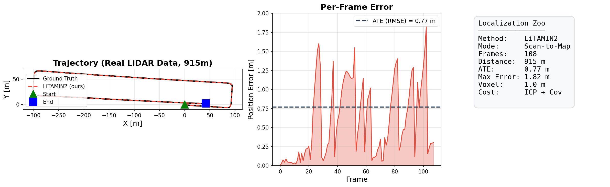

<p align="center">
  <h1 align="center">Localization Zoo</h1>
  <p align="center">
    <b>公式コード未公開のLocalization論文を、ROS2対応のC++で再現実装</b>
  </p>
  <p align="center">
    
    
    
    
    
  </p>
</p>

---

## Why Localization Zoo?

多くのLocalization論文は**公式コードが公開されない**まま埋もれていく。
このリポジトリは、そうした論文を**統一されたC++ API**で再現実装し、**ROS2ノード付き**で即座に使えるようにする。

- **純粋C++**: ROS非依存のコアライブラリ。組み込み・研究・教育に
- **ROS2 Humble**: 6つのノードが`ros2 run`で即実行
- **ベンチマーク内蔵**: ビルド後すぐ`./synthetic_benchmark`で全手法を比較
- **退化対策**: トンネル・地下でもドリフトしないRELEAD/X-ICPを収録

---

## Benchmark

### Real LiDAR Data (108 frames, 915m trajectory)

<p align="center">
  
</p>

```
Method         ATE [m]     Distance    Frames
──────────────────────────────────────────────
LiTAMIN2       0.77        915 m       108      Scan-to-Map, Voxel=1.0m
```

> `./pcd_dogfooding <pcd_dir> <gt_csv> [max_frames] [--force-ct-lio] [--ct-lio-estimate-bias] [--ct-lio-fixed-lag-window N] [--ct-lio-fixed-lag-velocity-weight W] [--ct-lio-fixed-lag-gyro-bias-scale W] [--ct-lio-fixed-lag-accel-bias-scale W] [--ct-lio-fixed-lag-history-decay W] [--ct-lio-fixed-lag-outer-iterations N] [--ct-lio-fixed-lag-smoother]` で任意のPCD連番データを評価可能
>
> `CT-LIO` は `imu.csv` があり、かつ raw LiDAR scan に近い高密度時系列を前提とする。`graph/000000xx/cloud.pcd` のような疎な keyframe/submap 列では自動スキップされる。
>
> ROS1 bag から raw sequence を切り出すときは `./evaluation/scripts/extract_ros1_lidar_imu.py --pointcloud-bag corrected.bag --imu-bag record_slam.bag --output-dir dogfooding_results/raw_seq` を使える。
> 長い run で手法を絞るときは `./pcd_dogfooding ... --methods ct_lio` のように指定できる。
> `--ct-lio-estimate-bias` は実験用で、前フレーム bias を random walk prior で持ち回る。
> `--ct-lio-fixed-lag-window 4` のように指定すると、直近数フレームの velocity / bias を window prior に使う。現状の default は `velocity_weight=0.0`, `gyro_bias_scale=0.25`, `accel_bias_scale=0.25`, `history_decay=1.0` で、`history_decay<1` にすると直前 state を強く見る prior に寄せられる。
> `--ct-lio-fixed-lag-smoother` は window 内の `begin/end pose + begin_velocity + bias` を local point-to-plane + IMU residual で再最適化する experimental 経路。
> `--ct-lio-fixed-lag-outer-iterations` は smoother の correspondence relinearization 回数。現状は `3` が精度優先の default で、`1` に落とすと軽くなるが long run の ATE は悪化しやすい。

### Synthetic Urban (30 frames)

```
Method         ATE [m]     FPS
─────────────────────────────────
CT-ICP         0.124       0.1   << 最高精度
A-LOAM         2.059       4.6   << バランス型
X-ICP          16.634      5.9
LiTAMIN2       31.155      2.6
```

> `./synthetic_benchmark` で再現可能。外部データ不要。

---

## Implementations

### Point Cloud Registration

| Paper | Venue | Key Idea | Code |
|-------|-------|----------|------|
| **[LiTAMIN2](papers/litamin2/)** | ICRA 2021 | KLダイバージェンスICP。95%点群削減で高速化 | [arXiv](https://arxiv.org/abs/2103.00784) |
| **[GICP](papers/gicp/)** | RSS 2009 | 局所共分散を使った平面対平面ICP。マハラノビス距離で最適化 | [Paper](https://www.roboticsproceedings.org/rss05/p31.html) |
| **[Voxel-GICP](papers/voxel_gicp/)** | RA-L 2021 | ボクセル代表点 + 共分散でGICPを高速化 | [Paper](https://arxiv.org/abs/2109.07082) |
| **[small_gicp](papers/small_gicp/)** | Derived | voxel downsample + capped correspondences の compact GICP | [GitHub](https://github.com/koide3/small_gicp) |
| **[VGICP-SLAM](papers/vgicp_slam/)** | Derived | Voxel-GICP front-end + Scan Context/Voxel-GICP loop graph | - |
| **[NDT](papers/ndt/)** | IROS 2003 | 正規分布変換。ボクセルごとのガウシアンに対してNewton法で最適化 | [Paper](https://ieeexplore.ieee.org/document/1249285) |
| **[KISS-ICP](papers/kiss_icp/)** | RA-L 2023 | ボクセルハッシュ + 適応閾値 + Welsch kernel の軽量ICP | [Paper](https://arxiv.org/abs/2209.15397) |
| **[A-LOAM](papers/aloam/)** | RSS 2014 | 曲率ベース特徴抽出 + 3段パイプライン (Odom→Map) | [GitHub (ROS1)](https://github.com/HKUST-Aerial-Robotics/A-LOAM) |
| **[F-LOAM](papers/floam/)** | Derived | input thinning + sparse mapping updates を入れた lightweight LOAM pipeline | - |
| **[ISC-LOAM](papers/isc_loam/)** | Derived | intensity descriptor + F-LOAM/GICP loop graph の lightweight LOAM | - |
| **[LOAM Livox](papers/loam_livox/)** | Derived | azimuth sector で pseudo scan line を作るソリッドステート向け LOAM | [Reference](https://github.com/hku-mars/loam_livox) |
| **[LeGO-LOAM](papers/lego_loam/)** | IROS 2018 | ground-aware な feature 抽出を前段に置いた地上車両向け LOAM | [Paper](https://ieeexplore.ieee.org/document/8594299) |
| **[MULLS](papers/mulls/)** | Derived | edge + plane + point を同時に使う multi-metric scan-to-map | - |
| **[BALM2](papers/balm2/)** | T-RO 2022 | 直近 keyframe 窓の pose を line / plane residual でまとめて詰める local BA | [arXiv](https://arxiv.org/abs/2209.08854) |
| **[SuMa](papers/suma/)** | RSS 2018 | range image 由来 surfel map に対する dense point-to-plane odometry | [GitHub](https://github.com/jbehley/SuMa) |
| **[DLO](papers/dlo/)** | Derived | dense point cloud を GICP で local map に直接合わせる keyframe odometry | [GitHub](https://github.com/vectr-ucla/direct_lidar_odometry) |
| **[HDL Graph SLAM](papers/hdl_graph_slam/)** | Derived | NDT front-end + floor prior + Scan Context/GICP loop graph の lightweight graph SLAM | [GitHub](https://github.com/koide3/hdl_graph_slam) |
| **[CT-ICP](papers/ct_icp/)** | ICRA 2022 | 1フレーム=2ポーズ(12DoF)。SLERP補間でモーション歪み補償 | [GitHub (ROS1)](https://github.com/jedeschaud/ct_icp) |
| **[X-ICP](papers/xicp/)** | T-RO 2024 | ヘシアンSVDで6方向のローカライズ可能性を分類。制約付きICP | [arXiv](https://arxiv.org/abs/2211.16335) |

### Degeneracy-Aware (退化対策)

| Paper | Venue | Key Idea | Code |
|-------|-------|----------|------|
| **[RELEAD](papers/relead/)** | ICRA 2024 | 制約付きESIKF + 退化方向への更新を射影で除去 | [arXiv](https://arxiv.org/abs/2402.18934) |
| **[CT-ICP + RELEAD](papers/ct_icp_relead/)** | Hybrid | CT-ICPの連続時間補間 + RELEADの退化検知 | - |

### Foundation

| Paper | Venue | Key Idea | Code |
|-------|-------|----------|------|
| **[IMU Preintegration](papers/imu_preintegration/)** | T-RO 2017 | SO(3)多様体上の事前積分。バイアス1次補正。全LIOの基盤 | [Paper](https://arxiv.org/abs/1512.02363) |

### LIO / Continuous-Time Fusion

| Paper | Venue | Key Idea | Code |
|-------|-------|----------|------|
| **[CT-LIO](papers/ct_lio/)** | Hybrid | CT-ICPの2ポーズ連続時間補間 + IMU事前積分拘束による軽量LIO | [CLINS](https://arxiv.org/abs/2109.04687) |
| **[DLIO](papers/dlio/)** | ICRA 2023 | DLO 系 direct scan-to-map に IMU preintegration を足した軽量 LIO | [GitHub](https://github.com/vectr-ucla/direct_lidar_inertial_odometry) |
| **[LINS](papers/lins/)** | Derived | iterated filter + point-to-plane local map update の軽量 LiDAR-Inertial state estimator | - |
| **[Point-LIO](papers/point_lio/)** | Derived | raw-point planarity correspondence + iterated filter の compact direct LIO | - |
| **[CLINS](papers/clins/)** | Derived | CT-LIO registration を sequence pipeline 化した compact continuous-time LIO | - |
| **[VILENS](papers/vilens/)** | Derived | Point-LIO 系 local map に landmark reprojection fusion を足した compact V-L-I smoother | - |
| **[LIO-SAM](papers/lio_sam/)** | IROS 2020 | A-LOAM front-end + Scan Context + GICP + IMU回転拘束の軽量pose graph | [Paper](https://arxiv.org/abs/2007.00258) |
| **[LVI-SAM](papers/lvi_sam/)** | Derived | LIO-SAM pose graph に landmark reprojection を足した compact V-L-I SLAM | - |
| **[VINS-Fusion](papers/vins_fusion/)** | Derived | landmark reprojection + IMU preintegration の compact visual-inertial odometry | - |
| **[OKVIS](papers/okvis/)** | Derived | fixed-size local window + landmark reprojection + IMU preintegration の compact VIO | - |
| **[ORB-SLAM3](papers/orb_slam3/)** | Derived | visual-inertial keyframe graph + landmark-overlap loop closure の compact V-SLAM | - |
| **[FAST-LIO2](papers/fast_lio2/)** | T-RO 2022 | raw point を直接使う scan-to-map + IMU予測の軽量direct LIO | [Paper](https://ieeexplore.ieee.org/document/9858003) |
| **[FAST-LIVO2](papers/fast_livo2/)** | Derived | FAST-LIO2 pose に reprojection residual を直接掛ける compact local V-L-I odometry | - |
| **[R2LIVE](papers/r2live/)** | Derived | FAST-LIO2 raw odom + visual landmark factor graph の compact V-L-I SLAM | - |
| **[FAST-LIO-SLAM](papers/fast_lio_slam/)** | Derived | FAST-LIO2 front-end + Scan Context + GICP loop closure の lightweight graph SLAM | - |

### Place Recognition / Loop Closure

| Paper | Venue | Key Idea | Code |
|-------|-------|----------|------|
| **[Scan Context](papers/scan_context/)** | IROS 2018 | 極座標の ring/sector 記述子 + yaw shift 探索による軽量場所認識 | [Paper](https://ieeexplore.ieee.org/document/8593953) |

---

## Quick Start

```bash
# 依存 (Ubuntu 22.04)
sudo apt install libeigen3-dev libpcl-dev libopencv-dev libceres-dev libgtest-dev

# ビルド & テスト
mkdir build && cd build
cmake .. && make -j$(nproc)
ctest                          # 38/38 PASS

# ベンチマーク (外部データ不要)
./evaluation/synthetic_benchmark
```

### ROS2

```bash
cd ros2 && colcon build
source install/setup.bash

# 任意のアルゴリズムを起動
ros2 run localization_zoo_ros litamin2_node
ros2 run localization_zoo_ros aloam_node
ros2 run localization_zoo_ros ct_icp_node
ros2 run localization_zoo_ros ct_lio_node
ros2 run localization_zoo_ros relead_node   # + IMU対応, 退化検知publish
ros2 run localization_zoo_ros xicp_node     # 退化検知publish

# rosbag再生
ros2 launch localization_zoo_ros play_rosbag.launch.py \
  bag_path:=/path/to/bag points_topic:=/velodyne_points
```

### Evaluate

```bash
# 任意のデータセット (KITTI/MulRan/nuScenes/TUM) のポーズを比較
python3 evaluation/scripts/benchmark.py \
  --gt gt_poses.txt \
  --est LiTAMIN2:litamin2_poses.txt A-LOAM:aloam_poses.txt \
  --output_dir results/
```

---

## Architecture

```
localization_zoo/
├── common/                    # Eigen/PCL共通ユーティリティ
├── papers/
│   ├── litamin2/              # KLダイバージェンスICP
│   ├── gicp/                  # Generalized ICP
│   ├── voxel_gicp/            # Voxelized GICP
│   ├── small_gicp/            # Compact lightweight GICP
│   ├── vgicp_slam/            # Voxel-GICP based graph SLAM
│   ├── ndt/                   # Normal Distributions Transform
│   ├── kiss_icp/              # KISS-ICP
│   ├── scan_context/          # Loop closure / place recognition
│   ├── aloam/                 # LOAM 3段パイプライン
│   ├── floam/                 # Fast LOAM style lightweight pipeline
│   ├── isc_loam/              # Intensity-aware loop-closure LOAM
│   ├── loam_livox/            # Solid-state LiDAR oriented LOAM
│   ├── lego_loam/             # Ground-aware LOAM for UGV
│   ├── mulls/                 # Multi-metric scan-to-map
│   ├── balm2/                 # Local bundle adjustment mapping
│   ├── suma/                  # Surfel-based dense LiDAR odometry
│   ├── dlo/                   # Direct LiDAR odometry
│   ├── hdl_graph_slam/        # NDT + graph-based LiDAR SLAM
│   ├── ct_icp/                # Continuous-Time ICP
│   ├── ct_lio/                # Continuous-Time LiDAR-Inertial Odometry
│   ├── dlio/                  # Direct LiDAR-Inertial odometry
│   ├── lins/                  # Iterated filter LIO
│   ├── point_lio/             # Direct raw-point LiDAR-Inertial Odometry
│   ├── clins/                 # Continuous-time LiDAR-Inertial pipeline
│   ├── lio_sam/               # Graph-based LiDAR-Inertial SLAM
│   ├── lvi_sam/               # Graph-based visual-lidar-inertial SLAM
│   ├── vins_fusion/           # Compact visual-inertial odometry
│   ├── okvis/                 # Local-window visual-inertial odometry
│   ├── orb_slam3/             # Visual-inertial SLAM with compact loop closure
│   ├── fast_lio2/             # Direct LiDAR-Inertial Odometry
│   ├── fast_lio_slam/         # FAST-LIO2 + loop-closure graph SLAM
│   ├── relead/                # 退化検知 + 制約付きESIKF
│   ├── xicp/                  # ローカライズ可能性ICP
│   ├── ct_icp_relead/         # ハイブリッド
│   └── imu_preintegration/    # IMU事前積分
├── evaluation/                # ベンチマーク & 評価ツール
├── ros2/                      # ROS2 Humble ラッパー
└── .github/workflows/ci.yml   # CI
```

各 `papers/*/` は **ヘッダ + ソース + テスト** の自己完結構造。
コアライブラリはROS非依存なので、ROS2なしでも単体で使える。

---

## Degeneracy Detection Demo

RELEAD / X-ICP はトンネルなどの退化環境を自動検知:

```
=== Tunnel Environment ===
Has degeneracy: yes
Degenerate translation dirs: 1
  dir: [1, 0, 0]              # x方向 (トンネル軸) が退化

=== Normal Environment ===
Has degeneracy: no             # 壁+地面で全方向拘束
```

ROS2ノードでは `/degeneracy` トピック (`std_msgs/Bool`) でリアルタイム通知。

---

## Adding a New Paper

```bash
mkdir -p papers/your_method/{include/your_method,src,test}
# 1. ヘッダ・ソース・テストを書く
# 2. CMakeLists.txt を追加
# 3. トップレベル CMakeLists.txt に add_subdirectory
# 4. ctest で全テスト通過を確認
```

---

## Dependencies

| Library | Version | Purpose |
|---------|---------|---------|
| Eigen3 | >= 3.3 | Linear algebra |
| PCL | >= 1.10 | Point cloud processing |
| Ceres Solver | >= 2.0 | Nonlinear optimization |
| GTest | >= 1.11 | Unit testing |
| OpenCV | >= 4.0 | I/O utilities |

## License

MIT
