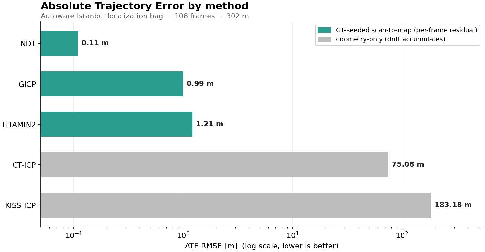

<p align="center">
  <h1 align="center">Localization Zoo</h1>
  <p align="center">
    <b>C++ implementations, derived variants, and compact baselines for localization papers</b>
  </p>
  <p align="center">
    
    
    
    
    
  </p>
</p>

---

## Why Localization Zoo?

Many localization papers do not ship reusable reference implementations.
This repository collects paper-oriented C++ implementations behind a unified API, with ROS 2 nodes and evaluation tools that are ready to run.

- **Pure C++**: ROS-independent core libraries for research, education, and embedded use
- **ROS 2 Humble**: Ready-to-run nodes via `ros2 run`
- **Built-in benchmarking**: Compare methods immediately after build
- **Degeneracy-aware methods**: Includes RELEAD and X-ICP for constrained environments

## Scope Note

This repository mixes three levels of implementation scope:

- **Paper reimplementation**: intended to track the published method closely
- **Derived variant**: built from the paper idea, but adapted to this repository's shared components
- **Compact baseline**: a smaller approximation that keeps the interface and core intuition, but not the full paper pipeline

Methods already labeled `Derived` or `Hybrid` are intentionally adapted versions.
Some paper-named entries still use compact or simplified internals today, especially `NDT`, `KISS-ICP`, and `DLIO`. Check each method README for current scope and deviations.

---

## Benchmark

### Real LiDAR Data

The repository currently ships one real-data benchmark snapshot from the official Autoware Istanbul localization bag.
GitHub Pages publishes the latest repository-stored report from [`docs/benchmarks/latest/results.json`](docs/benchmarks/latest/results.json).
The current snapshot uses a speed-oriented dogfooding profile with recent/local-map pruning.
`LiTAMIN2` additionally uses OpenMP-enabled voxel-map and cost accumulation in this repository.
For GT-seeded scan-to-map methods, weak updates fall back to the seed pose instead of forcing a poor refinement.

- Topic: `/localization/util/downsample/pointcloud`
- Window: frames `10200-10307`
- Sequence length: `108` frames, `302.1 m`, `10.70 s`
- Reference poses: `reference_pose_full.csv`
- Scan density: `940-1380` points per frame, `1128.7` average

| Method | Status | ATE [m] | FPS | Notes |
|--------|--------|---------|-----|-------|
| NDT | OK | 0.109 | 1.5 | GT-seeded scan-to-map init with weak-update fallback; current snapshot uses a recent/local-map profile |
| LiTAMIN2 | OK | 1.153 | 17.3 | GT-seeded scan-to-map init with weak-update fallback; current snapshot uses a recent/local-map profile plus OpenMP parallelism |
| GICP | OK | 0.994 | 3.8 | GT-seeded scan-to-map init with weak-update fallback; current snapshot uses a recent/local-map profile |
| CT-ICP | OK | 75.075 | 1.5 | Odometry-only; ATE is measured after anchoring to the first GT pose |
| KISS-ICP | OK | 183.178 | 4.4 | Odometry-only; ATE is measured after anchoring to the first GT pose |
| CT-LIO | SKIPPED | - | - | The bag window does not contain IMU data, so `imu.csv` was not generated |



`./pcd_dogfooding <pcd_dir> <gt_csv> [max_frames] [--force-ct-lio] [--methods litamin2,gicp,ndt,kiss_icp,ct_lio,ct_icp] [--litamin2-paper-profile] [--litamin2-icp-only] [--litamin2-voxel-resolution X] [--litamin2-max-iterations N] [--litamin2-num-threads N] [--ct-lio-estimate-bias] [--ct-lio-fixed-lag-window N] [--ct-lio-fixed-lag-velocity-weight W] [--ct-lio-fixed-lag-gyro-bias-scale W] [--ct-lio-fixed-lag-accel-bias-scale W] [--ct-lio-fixed-lag-history-decay W] [--ct-lio-fixed-lag-outer-iterations N] [--ct-lio-fixed-lag-smoother]` evaluates sequential PCD datasets.

`CT-LIO` expects `imu.csv` plus a dense raw LiDAR sequence. Sparse keyframe or submap sequences such as `graph/000000xx/cloud.pcd` are skipped automatically.

To extract a raw sequence from ROS 1 bags, use `./evaluation/scripts/extract_ros1_lidar_imu.py --pointcloud-bag corrected.bag --imu-bag record_slam.bag --output-dir dogfooding_results/raw_seq`.

To reproduce the repository-stored Istanbul run from a ROS 2 bag:

```bash
python3 -m pip install rosbags numpy matplotlib

python3 evaluation/scripts/extract_ros2_lidar_imu.py \
  --bag ../lidarloc_ws/data/official/autoware_istanbul/localization_rosbag \
  --pointcloud-topic /localization/util/downsample/pointcloud \
  --output-dir dogfooding_results/autoware_istanbul_open_108 \
  --start-frame 10200 \
  --max-frames 108

python3 evaluation/scripts/reference_pose_to_gt_csv.py \
  --input ../lidarloc_ws/data/official/autoware_istanbul/reference_pose_full.csv \
  --output dogfooding_results/autoware_istanbul_open_108_gt.csv

./build/evaluation/pcd_dogfooding \
  dogfooding_results/autoware_istanbul_open_108 \
  dogfooding_results/autoware_istanbul_open_108_gt.csv \
  --methods litamin2,gicp,ndt,kiss_icp,ct_lio,ct_icp
```

`LiTAMIN2`, `GICP`, and `NDT` currently use GT-seeded scan-to-map initialization inside `pcd_dogfooding` so that sequential PCD exports remain comparable.
If a refinement step becomes weak or unstable, the current dogfooding profile falls back to that seeded pose instead of forcing the update.
`--litamin2-paper-profile` switches LiTAMIN2 to a more paper-like setting centered on `voxel_resolution=3.0`.
`--litamin2-icp-only` disables the covariance-shape term so the first KL-derived distance term can be benchmarked on its own.
`KISS-ICP` and `CT-ICP` remain odometry-style methods in this tool, so their absolute ATE is reported after anchoring the estimated trajectory to the first GT pose.
For long runs, methods can be filtered with `./pcd_dogfooding ... --methods gicp,ndt,kiss_icp`.
`--ct-lio-estimate-bias` is experimental and carries the previous-frame bias with a random-walk prior.
`--ct-lio-fixed-lag-window 4` enables a short history prior on velocity and bias. Current defaults are `velocity_weight=0.0`, `gyro_bias_scale=0.25`, `accel_bias_scale=0.25`, and `history_decay=1.0`. Lower `history_decay` biases the prior toward the most recent state.
`--ct-lio-fixed-lag-smoother` re-optimizes `begin/end pose + begin_velocity + bias` inside the window with local point-to-plane and IMU residuals.
`--ct-lio-fixed-lag-outer-iterations` controls correspondence relinearization passes in the smoother. The current default is `3` for accuracy; `1` is lighter but usually hurts long-run ATE.

### Synthetic Urban (30 frames)

```
Method         ATE [m]     FPS
─────────────────────────────────
CT-ICP         0.124       0.1   << best accuracy
A-LOAM         2.059       4.6   << balanced baseline
X-ICP          16.634      5.9
LiTAMIN2       31.155      2.6
```

> Reproduce with `./synthetic_benchmark`. No external dataset is required.

---

## Implementations

### Point Cloud Registration

| Paper | Venue | Key Idea | Reference |
|-------|-------|----------|-----------|
| **[LiTAMIN2](papers/litamin2/)** | ICRA 2021 | KL-divergence ICP with aggressive point reduction for faster registration | [arXiv](https://arxiv.org/abs/2103.00784) |
| **[GICP](papers/gicp/)** | RSS 2009 | Plane-to-plane ICP with local covariance modeling and Mahalanobis distance | [Paper](https://www.roboticsproceedings.org/rss05/p31.html) |
| **[Voxel-GICP](papers/voxel_gicp/)** | RA-L 2021 | GICP accelerated with voxel representatives and voxel-level covariance | [Paper](https://arxiv.org/abs/2109.07082) |
| **[small_gicp](papers/small_gicp/)** | Derived | Compact GICP with voxel downsampling and capped correspondences | [GitHub](https://github.com/koide3/small_gicp) |
| **[VGICP-SLAM](papers/vgicp_slam/)** | Derived | Voxel-GICP front-end with Scan Context and loop-graph back-end | - |
| **[NDT](papers/ndt/)** | IROS 2003 | NDT-style registration against voxel Gaussian models with a compact optimizer | [Paper](https://ieeexplore.ieee.org/document/1249285) |
| **[KISS-ICP](papers/kiss_icp/)** | RA-L 2023 | Compact KISS-ICP-style pipeline with voxel hashing, adaptive thresholds, and robust ICP | [Paper](https://arxiv.org/abs/2209.15397) |
| **[A-LOAM](papers/aloam/)** | RSS 2014 | Curvature-based feature extraction with a three-stage odom-to-map pipeline | [GitHub (ROS1)](https://github.com/HKUST-Aerial-Robotics/A-LOAM) |
| **[F-LOAM](papers/floam/)** | Derived | Lightweight LOAM pipeline with input thinning and sparse map updates | - |
| **[ISC-LOAM](papers/isc_loam/)** | Derived | Lightweight LOAM with intensity descriptors and F-LOAM/GICP loop graph | - |
| **[LOAM Livox](papers/loam_livox/)** | Derived | LOAM variant for solid-state LiDAR using pseudo scan lines from azimuth sectors | [Reference](https://github.com/hku-mars/loam_livox) |
| **[LeGO-LOAM](papers/lego_loam/)** | IROS 2018 | Ground-aware feature extraction for vehicle-oriented LOAM | [Paper](https://ieeexplore.ieee.org/document/8594299) |
| **[MULLS](papers/mulls/)** | Derived | Multi-metric scan-to-map alignment using edge, plane, and point residuals | - |
| **[BALM2](papers/balm2/)** | T-RO 2022 | Local bundle adjustment over recent keyframes with line and plane residuals | [arXiv](https://arxiv.org/abs/2209.08854) |
| **[SuMa](papers/suma/)** | RSS 2018 | Dense surfel-based point-to-plane odometry from range-image maps | [GitHub](https://github.com/jbehley/SuMa) |
| **[DLO](papers/dlo/)** | Derived | Direct keyframe odometry that aligns dense scans to a local GICP map | [GitHub](https://github.com/vectr-ucla/direct_lidar_odometry) |
| **[HDL Graph SLAM](papers/hdl_graph_slam/)** | Derived | NDT front-end with floor priors, Scan Context, and GICP loop closures | [GitHub](https://github.com/koide3/hdl_graph_slam) |
| **[CT-ICP](papers/ct_icp/)** | ICRA 2022 | Continuous-time registration with two poses per frame and SLERP motion compensation | [GitHub (ROS1)](https://github.com/jedeschaud/ct_icp) |
| **[X-ICP](papers/xicp/)** | T-RO 2024 | Constrained ICP using Hessian SVD to classify observable directions | [arXiv](https://arxiv.org/abs/2211.16335) |

### Degeneracy-Aware Methods

| Paper | Venue | Key Idea | Reference |
|-------|-------|----------|-----------|
| **[RELEAD](papers/relead/)** | ICRA 2024 | Constrained ESIKF with projection-based suppression along degenerate directions | [arXiv](https://arxiv.org/abs/2402.18934) |
| **[CT-ICP + RELEAD](papers/ct_icp_relead/)** | Hybrid | Continuous-time CT-ICP interpolation combined with RELEAD degeneracy handling | - |

### Foundations

| Paper | Venue | Key Idea | Reference |
|-------|-------|----------|-----------|
| **[IMU Preintegration](papers/imu_preintegration/)** | T-RO 2017 | Preintegration on SO(3) with first-order bias correction for LIO pipelines | [Paper](https://arxiv.org/abs/1512.02363) |

### LIO / Continuous-Time Fusion

| Paper | Venue | Key Idea | Reference |
|-------|-------|----------|-----------|
| **[CT-LIO](papers/ct_lio/)** | Hybrid | Lightweight LIO that combines CT-ICP interpolation with IMU preintegration constraints | [CLINS](https://arxiv.org/abs/2109.04687) |
| **[DLIO](papers/dlio/)** | ICRA 2023 | Compact DLIO-style LIO built on DLO-style registration plus IMU preintegration | [GitHub](https://github.com/vectr-ucla/direct_lidar_inertial_odometry) |
| **[LINS](papers/lins/)** | Derived | Lightweight LiDAR-inertial estimator with iterated filtering and point-to-plane updates | - |
| **[Point-LIO](papers/point_lio/)** | Derived | Compact direct LIO with raw-point planarity correspondences and iterated filtering | - |
| **[CLINS](papers/clins/)** | Derived | Sequence pipeline version of CT-LIO-style continuous-time registration | - |
| **[VILENS](papers/vilens/)** | Derived | Compact visual-lidar-inertial smoother with Point-LIO-style local maps and reprojection fusion | - |
| **[LIO-SAM](papers/lio_sam/)** | IROS 2020 | Lightweight pose graph with A-LOAM front-end, Scan Context, GICP, and IMU rotation priors | [Paper](https://arxiv.org/abs/2007.00258) |
| **[LVI-SAM](papers/lvi_sam/)** | Derived | Compact visual-lidar-inertial SLAM built on top of a LIO-SAM-style pose graph | - |
| **[VINS-Fusion](papers/vins_fusion/)** | Derived | Compact visual-inertial odometry with landmark reprojection and IMU preintegration | - |
| **[OKVIS](papers/okvis/)** | Derived | Fixed-window VIO with landmark reprojection and IMU preintegration | - |
| **[ORB-SLAM3](papers/orb_slam3/)** | Derived | Compact visual-inertial SLAM with keyframe graph and overlap-based loop closure | - |
| **[FAST-LIO2](papers/fast_lio2/)** | T-RO 2022 | Lightweight direct LIO with raw-point scan-to-map alignment and IMU prediction | [Paper](https://ieeexplore.ieee.org/document/9858003) |
| **[FAST-LIVO2](papers/fast_livo2/)** | Derived | Compact local visual-lidar-inertial odometry built on FAST-LIO2 poses and reprojection residuals | - |
| **[R2LIVE](papers/r2live/)** | Derived | Compact visual-lidar-inertial SLAM combining FAST-LIO2 odometry and visual landmark factors | - |
| **[FAST-LIO-SLAM](papers/fast_lio_slam/)** | Derived | Lightweight graph SLAM with FAST-LIO2 front-end, Scan Context, and GICP loop closures | - |

### Place Recognition / Loop Closure

| Paper | Venue | Key Idea | Reference |
|-------|-------|----------|-----------|
| **[Scan Context](papers/scan_context/)** | IROS 2018 | Lightweight place recognition with polar ring-sector descriptors and yaw-shift search | [Paper](https://ieeexplore.ieee.org/document/8593953) |

---

## Quick Start

```bash
# Dependencies (Ubuntu 22.04)
sudo apt install libeigen3-dev libpcl-dev libopencv-dev libceres-dev libgtest-dev

# Build and test
mkdir build && cd build
cmake .. && make -j$(nproc)
ctest

# Benchmark (no external data required)
./evaluation/synthetic_benchmark
```

### ROS 2

```bash
cd ros2 && colcon build
source install/setup.bash

# Launch any algorithm node
ros2 run localization_zoo_ros litamin2_node
ros2 run localization_zoo_ros aloam_node
ros2 run localization_zoo_ros kiss_icp_node
ros2 run localization_zoo_ros ndt_node
ros2 run localization_zoo_ros ct_icp_node
ros2 run localization_zoo_ros gicp_node
ros2 run localization_zoo_ros dlo_node
ros2 run localization_zoo_ros ct_lio_node
ros2 run localization_zoo_ros fast_lio2_node
ros2 run localization_zoo_ros dlio_node
ros2 run localization_zoo_ros relead_node
ros2 run localization_zoo_ros xicp_node

# Play a rosbag
ros2 launch localization_zoo_ros play_rosbag.launch.py \
  bag_path:=/path/to/bag points_topic:=/velodyne_points
```

### Evaluation

```bash
# Compare trajectories on any dataset such as KITTI, MulRan, nuScenes, or TUM
python3 evaluation/scripts/benchmark.py \
  --gt gt_poses.txt \
  --est LiTAMIN2:litamin2_poses.txt A-LOAM:aloam_poses.txt \
  --output_dir results/
```

---

## Architecture

```
localization_zoo/
├── common/                    # Shared Eigen/PCL utilities
├── papers/
│   ├── litamin2/              # KL-divergence ICP
│   ├── gicp/                  # Generalized ICP
│   ├── voxel_gicp/            # Voxelized GICP
│   ├── small_gicp/            # Compact lightweight GICP
│   ├── vgicp_slam/            # Voxel-GICP graph SLAM
│   ├── ndt/                   # Normal Distributions Transform
│   ├── kiss_icp/              # KISS-ICP
│   ├── scan_context/          # Loop closure / place recognition
│   ├── aloam/                 # Three-stage LOAM pipeline
│   ├── floam/                 # Fast LOAM-style lightweight pipeline
│   ├── isc_loam/              # Intensity-aware loop-closure LOAM
│   ├── loam_livox/            # Solid-state LiDAR-oriented LOAM
│   ├── lego_loam/             # Ground-aware LOAM for UGVs
│   ├── mulls/                 # Multi-metric scan-to-map
│   ├── balm2/                 # Local bundle-adjustment mapping
│   ├── suma/                  # Surfel-based dense LiDAR odometry
│   ├── dlo/                   # Direct LiDAR odometry
│   ├── hdl_graph_slam/        # NDT plus graph-based LiDAR SLAM
│   ├── ct_icp/                # Continuous-time ICP
│   ├── ct_lio/                # Continuous-time LiDAR-inertial odometry
│   ├── dlio/                  # Direct LiDAR-inertial odometry
│   ├── lins/                  # Iterated-filter LIO
│   ├── point_lio/             # Direct raw-point LiDAR-inertial odometry
│   ├── clins/                 # Continuous-time LiDAR-inertial pipeline
│   ├── lio_sam/               # Graph-based LiDAR-inertial SLAM
│   ├── lvi_sam/               # Graph-based visual-lidar-inertial SLAM
│   ├── vins_fusion/           # Compact visual-inertial odometry
│   ├── okvis/                 # Local-window visual-inertial odometry
│   ├── orb_slam3/             # Visual-inertial SLAM with loop closure
│   ├── fast_lio2/             # Direct LiDAR-inertial odometry
│   ├── fast_lio_slam/         # FAST-LIO2 with loop-closure graph SLAM
│   ├── relead/                # Degeneracy-aware constrained ESIKF
│   ├── xicp/                  # Observability-aware ICP
│   ├── ct_icp_relead/         # Hybrid method
│   └── imu_preintegration/    # IMU preintegration
├── evaluation/                # Benchmark and evaluation tools
├── ros2/                      # ROS 2 Humble wrappers
└── .github/workflows/ci.yml   # CI
```

Each directory under `papers/*/` is self-contained with headers, sources, and tests.
The core libraries are ROS-independent and can be used without ROS 2.

---

## Degeneracy Detection Demo

RELEAD and X-ICP can detect degenerate geometry such as tunnel-like environments:

```
=== Tunnel Environment ===
Has degeneracy: yes
Degenerate translation dirs: 1
  dir: [1, 0, 0]              # x direction (tunnel axis) is degenerate

=== Normal Environment ===
Has degeneracy: no             # walls and ground constrain all directions
```

ROS 2 nodes publish real-time status on `/degeneracy` with `std_msgs/Bool`.

---

## Adding a New Paper

```bash
mkdir -p papers/your_method/{include/your_method,src,test}
# 1. Write headers, sources, and tests
# 2. Add CMakeLists.txt
# 3. Add add_subdirectory to the top-level CMakeLists.txt
# 4. Run ctest and keep the full suite passing
```

---

## Dependencies

| Library | Version | Purpose |
|---------|---------|---------|
| Eigen3 | >= 3.3 | Linear algebra |
| PCL | >= 1.10 | Point cloud processing |
| Ceres Solver | >= 2.0 | Nonlinear optimization |
| GTest | >= 1.11 | Unit testing |
| OpenCV | >= 4.0 | I/O utilities |

## License

MIT
