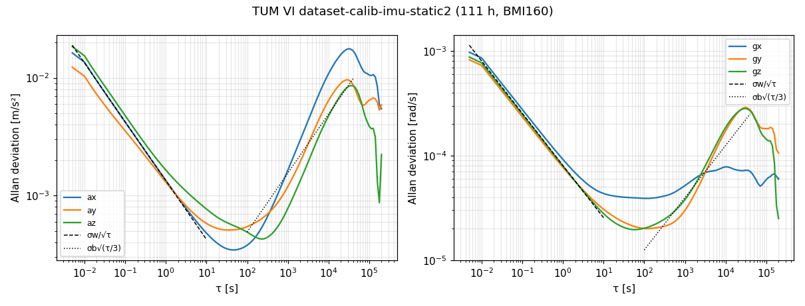

# Allan variance: TUM VI static IMU

_Generated by `papers/allan_variance/evaluation/tumvi_allan.py report`._

TUM VI `dataset-calib-imu-static2` (BMI160, CC BY 4.0): 111.4 h, 79,964,381 samples at 199.37 Hz. Overlapping Allan deviation with 20 cluster sizes per decade; the fits follow the paper's Fig. 5 caption (channels averaged, fixed slope, read off at tau = 1 s or 3 s).

| Parameter | Channels | Fit range [s] | Repo | TUM VI paper | Repo / paper |
|---|---|---|---:|---:|---:|
| gyro white noise density [rad/s/√Hz] | gx, gy, gz | 0.02-1 | 8.05e-05 | 8e-05 | 1.01x |
| gyro bias random walk [rad/s²/√Hz] | gy, gz | 1000-6000 | 2.17e-06 | 2.2e-06 | 0.98x |
| accel white noise density [m/s²/√Hz] | ax, ay, az | 0.02-1 | 0.00134 | 0.0014 | 0.96x |
| accel bias random walk [m/s³/√Hz] | ax, ay, az | 1000-6000 | 8.5e-05 | 8.6e-05 | 0.99x |

Per-axis automatic extraction (tangent fits; bias instability = Allan-deviation minimum / 0.664):

| Axis | White noise density | Bias random walk | Bias instability | at tau [s] |
|---|---:|---:|---:|---:|
| gx | 8.61e-05 | 3.24e-07 | 5.86e-05 | 112 |
| gy | 7.3e-05 | 1.64e-06 | 3.01e-05 | 126 |
| gz | 7.72e-05 | 2.07e-06 | 2.95e-05 | 56 |
| ax | 0.00133 | 0.000195 | 0.000519 | 45 |
| ay | 0.00102 | 0.000113 | 0.000767 | 36 |
| az | 0.00151 | 3.97e-05 | 0.000643 | 224 |

