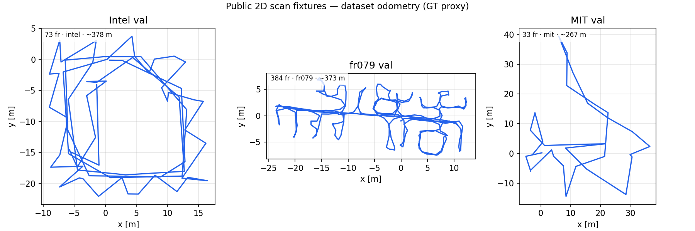

# 2D Laser Scan Odometry Benchmark

Planar `LaserScan` matchers evaluated with [`scan_dogfooding`](../../../evaluation/src/scan_dogfooding.cpp).
Metrics: **ATE [m]** and **Drift [%]** (KITTI-style RPE over a segment scaled to trajectory length).

## 結論

Eight from-paper 2D odometry ports (papers 43–50) share one harness. **No single method wins every
fixture** — RF2O leads Intel, PSM leads fr079, Kinematic-ICP leads the short MIT window, and
PL-ICP dominates the synthetic corridor. MbICP is competitive on fr079/MIT and nearly matches
PL-ICP on the synthetic corridor, while CSM remains weak there despite DT + pyramid improvements.

## Leaderboard (drift % — lower is better)

GT-seed on frame 0; `--no-gt-seed` supported for pure odometry runs.

| # | Method | Paper | Intel val | fr079 val | MIT val | Synth corridor |
|---|--------|-------|----------:|----------:|--------:|---------------:|
| | | | _73 fr / 378 m_ | _384 fr / 373 m_ | _33 fr / 267 m_ | _120 fr / 9.5 m_ |
| 43 | **RF2O** | ICRA 2016 | **14.3** | 15.4 | 27.6 | 1.3 |
| 48 | **NDT-2D** | IROS 2003 | 14.8 | 21.8 | 29.2 | 22.3 |
| 49 | **IDC** | Lu & Milios 1997 | 15.3 | 27.7 | 29.5 | 42.6 |
| 45 | **CSM** | ICRA 2009 | 16.0 | 20.6 | 29.2 | 73.3 |
| 44 | **PL-ICP** | IROS 2008 | 16.9 | 41.0 | 30.3 | **0.4** |
| 50 | **MbICP** | ICRA 2005 | 17.1 | 16.6 | 27.3 | 0.5 |
| 46 | **Kinematic-ICP** | ICRA 2025 | 18.4 | 18.9 | **23.4** | 83.8 |
| 47 | **PSM** | ICRA 2003 | 21.8 | **13.9** | 27.9 | 11.6 |

Public logs: [Bonn 2D-SLAM JSON](https://www.ipb.uni-bonn.de/html/projects/kuang2023ral/2dslam.zip)
(Radish CARMEN conversions). GT is dataset odometry (scan-matched proxy, not centimeter truth).



## 確認済み事実

| Item | Detail |
|------|--------|
| Harness | `scan_dogfooding` — `scan_meta.json`, `NNNNNNNN/scan.csv`, `gt.csv` |
| Methods | `rf2o,pl_icp,csm,kinematic_icp,psm,ndt_2d,idc,mb_icp` |
| CI smoke | `evaluation/scripts/smoke_scan2d_fixture.sh` (Intel 20 frames, all 8 methods) |
| Batch refresh | `evaluation/scripts/run_scan2d_benchmark.sh` |
| Prep (Bonn JSON) | `evaluation/scripts/prepare_bonn_2dslam_inputs.py` |
| Prep (ROS1 bag) | `evaluation/scripts/prepare_2d_scan_inputs.py` |
| Setup guide | [`evaluation/scripts/SETUP_2D_SCAN_BENCHMARK.md`](../../../evaluation/scripts/SETUP_2D_SCAN_BENCHMARK.md) |

### Committed fixtures

| Fixture | Source | Frames | Beams | Traj [m] |
|---------|--------|--------|-------|----------|
| `evaluation/fixtures/intel_val_73` | Bonn `intel/val.json` | 73 | 180 | ~378 |
| `evaluation/fixtures/fr079_val_384` | Bonn `fr079/val.json` | 384 | 360 | ~373 |
| `evaluation/fixtures/mit_val_33` | Bonn `mit/val.json` | 33 | 360 | ~267 |
| `evaluation/fixtures/rf2o_corridor` | synthetic raycast | 120 | 360 | ~9.5 |
| `evaluation/fixtures/rf2o_smoke` | synthetic raycast | 60 | 360 | ~18 |

### Per-method notes (honest)

- **RF2O** — best overall on Intel; range-flow dense constraint.
- **NDT-2D** — correspondence-free; competitive on real logs, weak on synthetic corridor.
- **IDC** — dual CP+RR fusion; mid-pack on Intel, behind RF2O/PSM on fr079.
- **CSM** — DT + 3-level pyramid (2026-06 refresh); fr079 38.9% → 20.6%, corridor still ~73%.
- **PL-ICP** — corridor winner; scan-to-scan ICP drifts on long public logs.
- **MbICP** — config-space metric ICP; good fr079/MIT balance and near-PL-ICP corridor behavior, slower than PL-ICP/RF2O.
- **Kinematic-ICP** — needs `--wheel-odom-from-gt`; best on short MIT window only.
- **PSM** — best fr079 drift; polar profile matching is dataset-dependent.

## Artifact index

Canonical multi-method JSON (refresh with `run_scan2d_benchmark.sh`):

| Fixture | Artifact |
|---------|----------|
| Intel val | [`intel_val_73.json`](intel_val_73.json) |
| fr079 val | [`fr079_val_384.json`](fr079_val_384.json) |
| MIT val | [`mit_val_33.json`](mit_val_33.json) |
| Corridor | [`rf2o_corridor.json`](rf2o_corridor.json) |
| Public summary | [`public_bundle.json`](public_bundle.json) |

Method-specific reruns (partial method sets): `*_idc.json`, `*_ndt2d.json`, `*_csm_dt.json`.

## Reproduce

```bash
cmake --build build --target scan_dogfooding
bash evaluation/scripts/run_scan2d_benchmark.sh
python3 evaluation/scripts/plot_scan2d_gt_overview.py
```

Single fixture, all methods:

```bash
./build/evaluation/scan_dogfooding \
  evaluation/fixtures/intel_val_73 evaluation/fixtures/intel_val_73/gt.csv \
  --methods rf2o,pl_icp,csm,kinematic_icp,psm,ndt_2d,idc,mb_icp \
  --wheel-odom-from-gt \
  --summary-json docs/benchmarks/scan2d/intel_val_73.json
```

## 未確認 / 要確認項目

- **MIT val** — only 33 frames; all drift values are indicative, not paper-grade.
- **Local map / SLAM graph** — PL-ICP and MbICP now expose optional rolling local maps in-library; the canonical harness still runs scan-to-scan. MbICP local-map smoke shows modest Intel/fr079 drift gains but needs a spatial index before benchmark enablement.

## 次アクション

1. Add spatial indexing (grid/kd-tree) and enable MbICP local map in the harness, or pursue a Karto-style map matcher.
2. Find a longer MIT/Bonn validation window for less fragile ranking.
