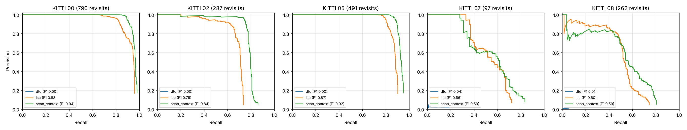

# KITTI place-recognition benchmark

_Generated by `evaluation/scripts/run_kitti_place_recognition.py`._

Loop-closure descriptors on full KITTI Odometry sequences, scored with the usual top-1 retrieval protocol. Every scan is queried against all scans at least 50 frames older, then added to the database. A query is a *revisit* when a ground-truth position within 4 m exists among those older scans; a prediction is correct when its top-1 match lies within that radius. Recall counts correct top-1 matches over all revisits, so a revisit whose best match is wrong is missed at every threshold. The descriptor binary never reads poses; labels are assigned afterwards from `experiments/reference_data/kitti_seq_NN_full_gt.csv`.

Methods:

- `dtd`: [DTD](../papers/dtd/) (2025, from-paper): BEV density keypoints, triangle hashing, SVD verification; score = inlier count
- `isc`: Intensity scan context from [ISC-LOAM](../papers/isc_loam/): the same search on max-intensity cells
- `scan_context`: [Scan Context](../papers/scan_context/) (IROS 2018): ring x sector max-height descriptor, ring-key prefilter (10 candidates), column-shift cosine distance

F1max is the best F1 over all score thresholds; R@100P is the recall at the highest threshold with no false positive (0 when the most confident match is wrong); top-1 is the share of revisits whose top-1 match is correct before any threshold. Times are single-threaded descriptor and search time per scan, measured on the machine that produced the per-query files.

| Sequence | Frames | Revisits | Method | F1max | Precision / recall at F1max | R@100P | Top-1 | ms / scan |
|---|---:|---:|---|---:|---|---:|---:|---:|
| KITTI 00 | 4541 | 790 | `dtd` | 0.000 | 0.000 / 0.000 | 0.000 | 0.000 | 133.5 |
| KITTI 00 | 4541 | 790 | `isc` | 0.879 | 0.957 / 0.813 | 0.659 | 0.959 | 8.0 |
| KITTI 00 | 4541 | 790 | `scan_context` | 0.935 | 0.982 / 0.892 | 0.830 | 0.981 | 7.3 |
| KITTI 02 | 4661 | 287 | `dtd` | 0.000 | 0.000 / 0.000 | 0.000 | 0.000 | 114.5 |
| KITTI 02 | 4661 | 287 | `isc` | 0.746 | 0.866 / 0.655 | 0.202 | 0.735 | 8.3 |
| KITTI 02 | 4661 | 287 | `scan_context` | 0.837 | 0.972 / 0.735 | 0.195 | 0.861 | 7.5 |
| KITTI 05 | 2761 | 491 | `dtd` | 0.000 | 0.000 / 0.000 | 0.000 | 0.000 | 87.9 |
| KITTI 05 | 2761 | 491 | `isc` | 0.872 | 0.968 / 0.794 | 0.737 | 0.902 | 8.7 |
| KITTI 05 | 2761 | 491 | `scan_context` | 0.920 | 0.984 / 0.864 | 0.823 | 0.949 | 7.7 |
| KITTI 07 | 1101 | 97 | `dtd` | 0.035 | 0.021 / 0.113 | 0.000 | 0.186 | 18.8 |
| KITTI 07 | 1101 | 97 | `isc` | 0.562 | 0.617 / 0.515 | 0.330 | 0.722 | 8.1 |
| KITTI 07 | 1101 | 97 | `scan_context` | 0.588 | 0.588 / 0.588 | 0.278 | 0.835 | 7.1 |
| KITTI 08 | 4071 | 262 | `dtd` | 0.013 | 0.008 / 0.042 | 0.000 | 0.057 | 142.8 |
| KITTI 08 | 4071 | 262 | `isc` | 0.597 | 0.787 / 0.481 | 0.015 | 0.744 | 8.3 |
| KITTI 08 | 4071 | 262 | `scan_context` | 0.592 | 0.760 / 0.485 | 0.038 | 0.805 | 7.4 |

Reading:

- Best F1max per sequence: KITTI 00 `scan_context` 0.935; KITTI 02 `scan_context` 0.837; KITTI 05 `scan_context` 0.920; KITTI 07 `scan_context` 0.588; KITTI 08 `isc` 0.597.
- KITTI 08 revisits its route mostly in the opposite direction, and there every method's recall at 100 % precision falls below 0.05; KITTI 07 has one short loop (97 revisits), so its curves are noisy.
- The DTD port finds almost no correct loops. A scan queried against itself verifies, but a scan about 1 m later does not: verification fits one SVD to all hash-matched triangles without outlier rejection. See [`papers/dtd/README.md`](../papers/dtd/README.md).
- Scan Context and ISC share the same search and differ only in the cell value (max height vs max reflectance), so their gap isolates the descriptor content.



Reproduce from the committed per-query files (no scans needed):

```bash
python3 evaluation/scripts/run_kitti_place_recognition.py --rescore-only
```

Re-run the descriptors (scans from `fetch_kitti_odometry_sequences.py` or a full KITTI copy):

```bash
cmake --build build --target place_recognition_benchmark
python3 evaluation/scripts/run_kitti_place_recognition.py --kitti-root /path/to/dataset
```
