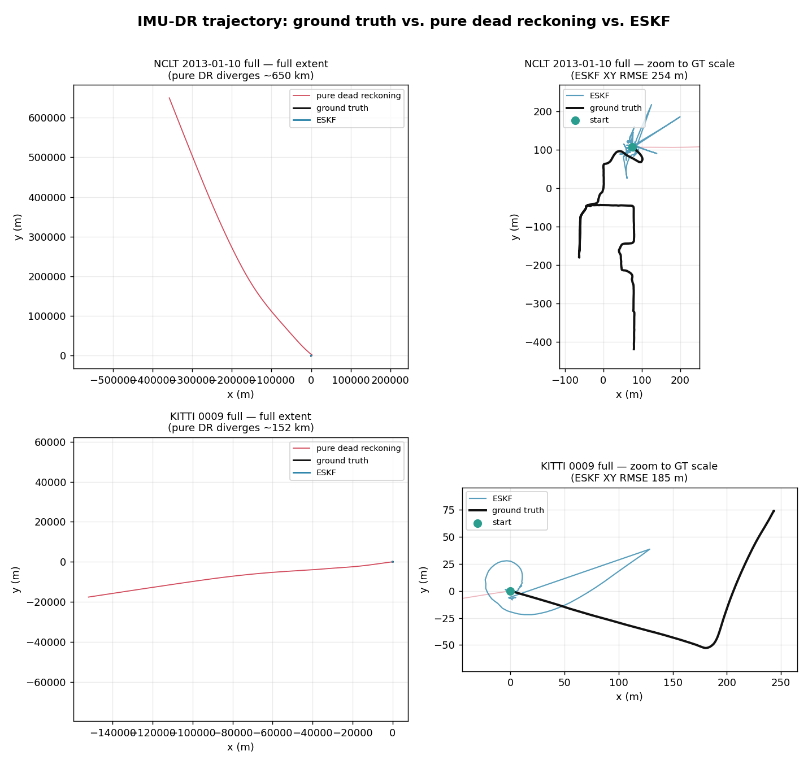
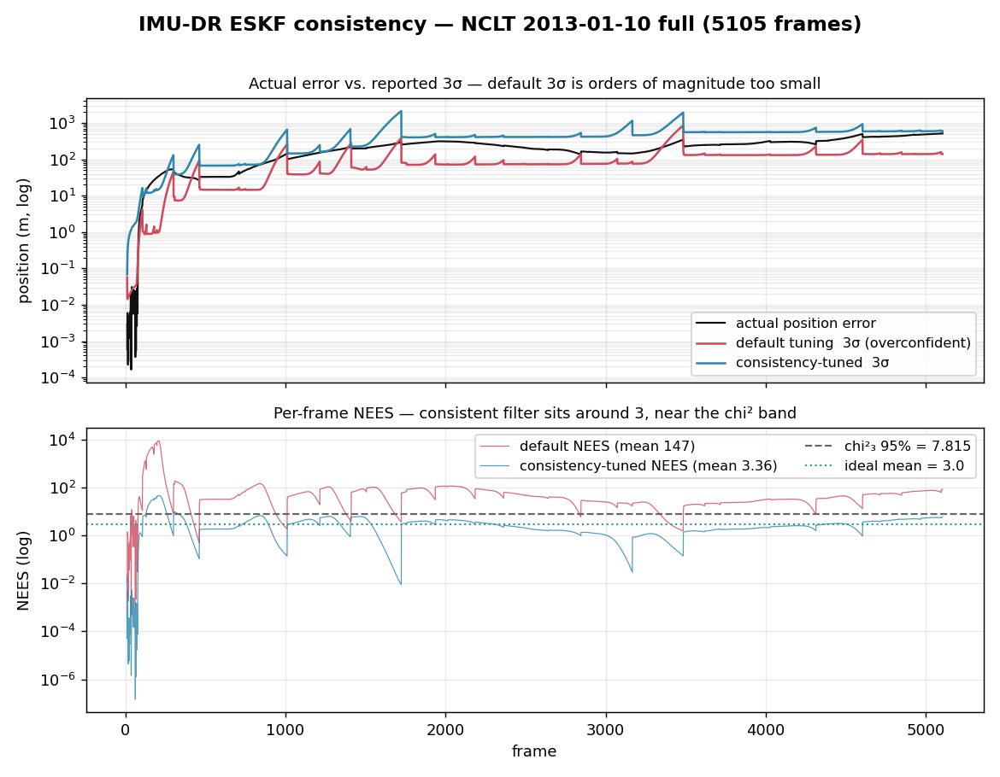

# IMU Dead Reckoning

Pure strapdown IMU-only dead reckoning. This is a **compact baseline, not a
paper reimplementation** — the unaided IMU-only lower-bound reference for the
LIO family (compare OdoNet / NHC-Net / NN-ZUPT, which all add a learned aid on
top of the same strapdown core). Claim tier **T3 smoke / concept** per
[`docs/paper_ready_reproducibility.md`](../../docs/paper_ready_reproducibility.md):
"This is a compact baseline or concept port."

## Core idea

1. **Static-window init** (first 2.0 s by default) — gyro bias estimated from
   the mean static gyro reading; initial roll/pitch aligned from the mean
   static accel vector; gravity magnitude taken from the static accel norm
   (falls back to 9.80665 if disabled).
2. **Midpoint quaternion/rotation integration** of bias-corrected gyro to
   propagate attitude (forward Euler available as an ablation).
3. **Double integration of specific force** — world-frame acceleration is
   `R * a - g_w`, integrated once for velocity and once for position. No
   NHC, no ZUPT, no LiDAR, no learned aiding unless explicitly enabled.

Everything beyond the strapdown core is an opt-in ablation knob, off by
default:

| Flag | Effect |
|---|---|
| `--imu-dr-zupt` | Enable zero-velocity updates (zeroes velocity when a windowed gyro/accel-norm gate detects "stationary"). |
| `--imu-dr-euler` | Forward Euler instead of the default midpoint gyro integration. |
| `--imu-dr-rk4` | Classical RK4 attitude integration (overrides midpoint/Euler), re-orthonormalized onto SO(3) each step. |
| `--imu-dr-no-gyro-bias` | Skip static-window gyro-bias estimation (bias stays zero). |
| `--imu-dr-static-init-sec <s>` | Override the static-init window length (default 2.0 s). |
| `--imu-dr-motion-gated-init` | Static-init **quality gate**: if the init window fails a stationarity check (too few samples, or gyro/accel-norm std over threshold), auto-skip gyro/accel-bias estimation instead of applying a bias estimated from non-static data. Auto-fixes the KITTI gyro-bias reversal without a manual `--imu-dr-no-gyro-bias`. |
| `--imu-dr-min-static-samples <n>` | Minimum samples for a trusted static window (default 5). |
| `--imu-dr-static-accel-std-gate <m/s^2>` | Accel-norm std gate for the quality check (default 0.5). |
| `--imu-dr-zupt-gyro-threshold <rad/s>` | ZUPT gyro-norm gate (default 0.05). |
| `--imu-dr-zupt-accel-tolerance <m/s^2>` | ZUPT `\|\|a\| - g\|` gate (default 0.8). |
| `--imu-dr-leveling` | Attitude leveling on detected-stationary samples: re-align roll/pitch toward the world gravity vector (yaw untouched). Attacks the dominant attitude-drift error. Shares the ZUPT stationary gate but does not require `--imu-dr-zupt`. |
| `--imu-dr-leveling-gain <0..1>` | Fraction of the roll/pitch error corrected per stationary sample (default 0.05). |
| `--imu-dr-zaru` | Zero Angular Rate Update: low-pass the running gyro bias toward the raw gyro on detected-stationary samples (online bias tracking). |
| `--imu-dr-zaru-gain <0..1>` | ZARU low-pass rate (default 0.01). |
| `--imu-dr-eskf` | **Error-State Kalman Filter mode.** Propagates a 15-state error covariance alongside the strapdown nominal state and re-interprets the aid flags as gain-weighted measurement updates instead of hard resets (`--imu-dr-zupt` → zero-velocity update, `--imu-dr-leveling` → gravity/accel update on roll/pitch + accel bias, `--imu-dr-nhc` → lateral/vertical body-velocity update). Estimates gyro/accel bias online; ZARU is subsumed and ignored. |
| `--imu-dr-eskf-sigma-accel <m/s^2>` | ESKF accel process-noise density (default 0.2). |
| `--imu-dr-eskf-sigma-gyro <rad/s>` | ESKF gyro process-noise density (default 0.02). |
| `--imu-dr-eskf-zupt-sigma <m/s>` | ESKF ZUPT velocity measurement noise (default 0.02). |
| `--imu-dr-eskf-leveling-sigma <m/s^2>` | ESKF gravity/leveling measurement noise (default 0.3). |
| `--imu-dr-eskf-nhc-sigma <m/s>` | ESKF NHC lateral/vertical measurement noise (default 0.1). |
| `--imu-dr-nhc` | Enable non-holonomic constraints (zero lateral/vertical body velocity; forward-only). |
| `--imu-dr-nhc-gain <gain>` | Soft NHC pull strength (default 0 = hard projection). |
| `--imu-dr-forward-axis <0\|1\|2>` | Body forward axis index (default 0 = x, KITTI Velodyne). |
| `--imu-dr-accel-bias` | Estimate accelerometer bias from the static-init window. |

## Tests

`test_imu_dead_reckoning` (17 cases, `ctest -R imu_dead_reckoning`):
`StaticWithKnownBiasHasNoDrift`, `ConstantYawRateNoTranslation`,
`ConstantWorldAccelerationMatchesAnalytic`,
`ZuptResetsVelocityAndLimitsTailDrift`, `IntegrateTrajectoryFrameSampling`,
`NhcSuppressesLateralVelocity`, `ZuptGateUsesBiasCorrectedAccelNorm`,
`Rk4ConstantYawRateMatchesAnalytic`, `AccelBiasEstimationRemovesStaticBias`,
`MotionGatedStaticInitSkipsContaminatedBias`,
`MotionGatedStaticInitPassesOnTrulyStatic`,
`LevelingCorrectsAttitudeTiltWhenStationary`,
`ZaruTracksGyroBiasAndStopsYawDrift`, `EskfZuptLimitsTailDrift`,
`EskfLevelingCorrectsTilt`, `EskfUpdatesShrinkCovariance`,
`CovarianceZeroWhenEskfOff`.

## Reproduce (requires `imu.csv`)

```sh
./build/evaluation/pcd_dogfooding dogfooding_results/nclt_2013_01_10_120 \
  experiments/reference_data/nclt_2013_01_10_120_gt.csv \
  --methods imu_dead_reckoning
```

Add `--imu-dr-zupt` / `--imu-dr-euler` / `--imu-dr-rk4` /
`--imu-dr-no-gyro-bias` / `--imu-dr-motion-gated-init` / `--imu-dr-leveling` /
`--imu-dr-zaru` / `--imu-dr-nhc` / `--imu-dr-accel-bias` to run a hard-aid
ablation variant. The best hard-aid stack is
`--imu-dr-zupt --imu-dr-nhc --imu-dr-leveling`; the best overall configuration
on the full sessions is the **ESKF**,
`--imu-dr-eskf --imu-dr-zupt --imu-dr-leveling` (~10x lower ATE than the hard
stack on NCLT full — see the ESKF result below). Full manifest:
[`experiments/imu_dead_reckoning_nclt_2013_01_10_matrix.json`](../../experiments/imu_dead_reckoning_nclt_2013_01_10_matrix.json),
aggregate result:
[`experiments/results/imu_dead_reckoning_nclt_2013_01_10_matrix.json`](../../experiments/results/imu_dead_reckoning_nclt_2013_01_10_matrix.json).

## Result (NCLT 2013-01-10, 120-frame window, ms25 IMU ~47 Hz, 11.5 m / ~24 s)

| Variant | ATE (m) | RPE (%/100m) | Notes |
|---|---|---|---|
| Default (pure DR, midpoint, no ZUPT) | 9.071 | 170.617 | Repository default; zupt_frames=0. |
| `--imu-dr-zupt` | 2.887 | 30.607 | zupt_frames=481/1051 IMU samples gated stationary — this short window has the vehicle at rest for a large fraction of the time, so the ATE/RPE win is **not representative of continuous motion** and should not be overclaimed. |
| `--imu-dr-euler` | 10.280 | 198.899 | Forward Euler vs default midpoint; integration scheme is a second-order effect next to ZUPT/gyro-bias. |
| `--imu-dr-rk4` | 9.072 | 170.644 | +0.01% vs default — RK4 and midpoint are indistinguishable here; both are high-order, so the win over Euler is the whole integration-scheme effect and RK4 adds nothing beyond midpoint. |
| `--imu-dr-no-gyro-bias` | 24.676 | 482.028 | Largest degradation of any ablation tested — static-window gyro-bias estimation is the single most load-bearing component of this baseline. |
| `--imu-dr-nhc` | 9.156 | 156.297 | Hard NHC alone: ~same ATE as default, mild RPE improvement (-8%). Lateral velocity stripping is a second-order effect on this short window. |
| `--imu-dr-nhc --imu-dr-zupt` | 3.717 | 18.521 | NHC+ZUPT stacks on this window: slightly worse ATE than ZUPT alone (2.887 m) but much better RPE (18.5% vs 30.6%). |
| `--imu-dr-accel-bias` | 9.075 | 170.704 | +0.04%/+0.05% — negligible. Estimating accel bias against fixed standard gravity finds almost no residual here: NCLT's ms25 static accel norm is very close to 9.80665, so there is little bias to remove. |

Family context on the same window (IMU-only dead-reckoning methods, for
scale — none of these are LiDAR/LIO and should not be read against the KITTI
point-cloud leaderboard):

| Method | ATE (m) | RPE (%/100m) | Notes |
|---|---|---|---|
| OdoNet | 138.872 | 1842.230 | KITTI-Raw-OXTS-trained CNN weights, out-of-domain on NCLT's ms25 IMU. |
| NHC-Net | 4.295 | 102.938 | |
| NN-ZUPT | 3.799 | 96.164 | |

Note: the experiment-matrix runner's automatic heuristic labeled `zupt`
"Adopt as current default" in
[`experiments/results/imu_dead_reckoning_nclt_2013_01_10_matrix.json`](../../experiments/results/imu_dead_reckoning_nclt_2013_01_10_matrix.json)
purely on the shared ATE/RPE score. The method's actual repository default
remains pure dead reckoning (ZUPT off) — see the stationarity caveat above
for why the `zupt` number on this particular window should not be read as a
general recommendation.

## Result (NCLT 2013-01-10, full session, 5105 frames, ~17 min / 1021.7 s, 1138.8 m)

Full-session export (~6.3 GB of ASCII PCDs; only needed for frame-count/GT
bookkeeping since IMU-DR does not read point clouds) lives on removable media
(`/media/sasaki/aiueo`, see [Limitations](#limitations--scope-notes)) because
the local disk had ~18 GB free at evaluation time.

| Variant | ATE (m) | RPE (%/100m) | Notes |
|---|---|---|---|
| Default (pure DR, midpoint, no ZUPT) | 288700.449 | 67435.005 | zupt_frames=0; ~250x the 1138.8 m trajectory length in RMSE -- uncorrected gyro bias/heading error compounds for the full ~17 min instead of the window's ~24 s. |
| `--imu-dr-zupt` | 14531.743 | 2859.304 | -94.97% ATE / -95.76% RPE vs. default. zupt_frames=3984/48122 IMU samples (~8.3%) gated stationary -- much lower than the 120-frame window's ~46%, so this session is mostly continuous motion, yet ZUPT still removes ~95% of the drift by repeatedly re-zeroing velocity error before it integrates into position error. |
| `--imu-dr-euler` | 291892.627 | 68484.744 | +1.11% ATE / +1.56% RPE vs. default. Integration scheme stays a small second-order effect even over ~17 minutes, same conclusion as the 120-frame window. |
| `--imu-dr-rk4` | 290555.090 | 67867.846 | +0.64% ATE / +0.64% RPE vs. default — between default midpoint and Euler, and much closer to midpoint. Over ~17 min the tiny per-step differences compound slightly, but RK4 still buys nothing meaningful over the default midpoint scheme. |
| `--imu-dr-no-gyro-bias` | 672302.751 | 139392.868 | +132.9% ATE / +106.7% RPE vs. default -- again the largest degradation of the three ablations, confirming static-init gyro-bias estimation as the single most load-bearing aid at any timescale tested. |
| `--imu-dr-nhc` | 46003.188 | 16267.197 | -84.1% ATE / -75.9% RPE vs. default. NHC alone is the second-most effective single aid on the full session after ZUPT, by suppressing lateral velocity drift that double integration would otherwise accumulate. |
| `--imu-dr-nhc --imu-dr-zupt` | 9605.455 | 1901.379 | -96.7% ATE / -97.2% RPE vs. default; **beats ZUPT alone** (14531.743 m / 2859.304%) on both metrics — the two classical vehicle aids stack on continuous-motion data. |
| `--imu-dr-accel-bias` | 288751.377 | 67446.881 | +0.02%/+0.02% — negligible, same explanation as the 120-frame window (ms25 static norm ≈ standard gravity, little accel bias to remove). |

All seven runs returned finite, physically explicable numbers (no NaNs, no
`1e6`+ km positions) -- the hundreds-of-km ATE is the expected honest failure
mode of unaided IMU-only dead reckoning compounding over ~17 minutes with no
external aiding, not a bug. Full-session manifest:
[`experiments/imu_dead_reckoning_nclt_2013_01_10_full_matrix.json`](../../experiments/imu_dead_reckoning_nclt_2013_01_10_full_matrix.json),
aggregate:
[`experiments/results/imu_dead_reckoning_nclt_2013_01_10_full_matrix.json`](../../experiments/results/imu_dead_reckoning_nclt_2013_01_10_full_matrix.json).

The 120-frame window's ZUPT caveat above should now be read alongside this
full-session number: the short window's ~46% (481/1051) stationary fraction
was flagged as unrepresentative, and the full session confirms that -- true
stationary fraction is only ~8.3% (3984/48122) -- but ZUPT is *still* the
dominant single aid at both scales, just for a different reason (bounding
velocity-error growth between infrequent resets rather than reflecting mostly
parked time).

On this full session the runner's automatic heuristic now labels `nhc_zupt`
"current default" (it beats ZUPT alone on both metrics); as with the other
windows this is a score-based label only -- the repository default remains
pure dead reckoning with all aids off.

## Result (KITTI Raw drive 2011_09_26_0009, OXTS)

Second dataset, using the established KITTI Raw fixture lineage
(`evaluation/scripts/kitti_raw_to_benchmark.py` +
`evaluation/scripts/kitti_oxts_imu_for_dogfooding.py`). Drive + calib
downloaded from the public, unauthenticated
`s3.eu-central-1.amazonaws.com/avg-kitti` mirror (`2011_09_26_drive_0009_sync.zip`,
1.79 GB; `2011_09_26_calib.zip`, 4 KB) to
`/media/sasaki/aiueo/loc_zoo/kitti_raw_download` (external SSD; local disk had
~16 GB free). GT for both windows was independently regenerated from the raw
drive and verified byte-identical (md5) to the already-committed
`experiments/reference_data/kitti_raw_0009_200_gt.csv` /
`kitti_raw_0009_full_gt.csv`, so no GT changes were needed.

**OXTS rate finding**: the sync package's `oxts/data/*.txt` is one packet per
Velodyne frame (447 OXTS samples vs. 443 retained Velodyne frames over
~46.2 s), i.e. **~9.7 Hz effective**, not the 100 Hz raw OXTS rate (that only
exists in the separate, unsynced `_extract` package). `--write-imu-csv` writes
one midpoint IMU row per LiDAR interval, so this is sparse for a strapdown DR
baseline -- worse than NCLT's ms25 ~47 Hz. A 100 Hz variant from the
`_extract` package's `oxts/timestamps.txt` was considered but **not built**:
`frame_timestamps.csv`'s `timestamp` column is the Velodyne file's positional
index (0, 1, 2, ...), not real time, and `pcd_dogfooding`'s GT association for
this fixture directly compares `imu.csv` stamps against those same integer
indices -- so `imu.csv` cannot be expressed in real seconds without breaking
GT association or the sample-selection walk in `integrateImuTrajectory`.
Rescaling would require changing `frame_timestamps.csv`/GT semantics shared by
every other method's `kitti_raw_0009*` leaderboard entry, well outside this
task's scope. Documented here rather than attempted.

**Deeper unit/timescale caveat (more important than the rate alone)**: because
`imu.csv` stamps live on that same synthetic per-frame-index timeline (rows
spaced exactly 1.0 index-unit apart: `0.5, 1.5, 2.5, ...`), the harness reports
`Frame gap [s]: min=median=mean=max=1.000` and IMU-DR's literal double
integration (`dt = imu.stamp[i] - imu.stamp[i-1]`, clamped to
`max_dt=0.5 s`) runs with an effective step of **0.5 s** per ~0.103 s of real
elapsed time (~4.8x too large per step) -- a structural property of this
fixture (shared by every `imu.csv`-consuming method here, tolerable for
LIO-style methods that use IMU as a soft prior, but not innocuous for a
literal-physics DR baseline). The 2.0 s `static_init_duration_s` window is
similarly compressed to only **~3 IMU samples (~0.3 s real time)** instead of
a genuine 2 s average.

**Static-init validity finding**: KITTI drive 0009 is a moving car, and the
static-init assumption is violated in the most direct way possible -- OXTS
forward speed at frame 0 is **~10.7 m/s** (already cruising), and over the
200-frame window the vehicle's speed **never drops below 1.339 m/s**. Despite
this, the pipeline's static-init warning (gated on gyro std vs. a 0.05 rad/s
threshold) **did not fire** on either window: the check only looks at
rotational noise, and this particular cruise segment happened to have low yaw
rate, so a real translational-motion violation of "static" produced no
warning. This is a genuine blind spot in the built-in stationarity check for
wheeled-vehicle data, not a bug in this evaluation.

**ZUPT false positives**: on the 200-frame window, ZUPT fires on 174/199
(~87%) of IMU samples even though ground-truth OXTS speed **never falls below
1.339 m/s** anywhere in that window (i.e. essentially 100% of ZUPT triggers
are false positives on low-yaw-rate cruising, not real stops). On the full
443-frame sequence, ZUPT fires on 344/442 (~78%) of samples vs. an actual
measured stationary fraction of only ~9.7% (43/443, concentrated near the end
where the vehicle slows for what looks like an intersection) -- roughly 8 out
of 9 triggers are false positives there too. The gyro/accel-norm gate cannot
distinguish "stationary" from "cruising straight at near-constant speed."
Despite this, ZUPT remains the single most effective aid at both window
sizes (see tables below), by bounding velocity-error growth via frequent
resets rather than by correctly detecting rest.

**Gyro-bias reversal (new, dataset-specific finding)**: unlike both NCLT
windows (where disabling static-init gyro-bias estimation was by far the
*worst* ablation, +133%/+172% ATE), on KITTI Raw 0009 disabling it is an
*improvement* on both windows (-87% ATE at 200 frames, -87% ATE at 443
frames). Honest explanation: the ~3-sample (~0.3 s real-time) static-init
window here is taken while the vehicle is already moving at ~10.7 m/s, so the
"bias" it estimates is contaminated by real angular rate rather than pure
sensor bias -- applying it as a correction is actively harmful. This
reproduces consistently across both window sizes, so it is a real dataset
effect, not an aggregation artifact of one window.

**Motion-gated static init auto-fix (`--imu-dr-motion-gated-init`)**: the
reversal above previously required the operator to *know* that KITTI needs a
manual `--imu-dr-no-gyro-bias` while NCLT must keep it. The quality gate
removes that foot-gun. On the compressed KITTI timeline the static window holds
only **3 IMU samples** (`static_init_duration_s / clamped-dt`), so the
`min_static_samples` check trips and bias estimation is auto-skipped; the note
string records exactly why (`static-init quality gate tripped (too-few-samples
samples=3 gyro_std=0.0241 accel_std=0.447)`). The result is bit-for-bit the
manual `--imu-dr-no-gyro-bias` number on both windows, with no manual flag:

| Window | Default (bias applied) | `--imu-dr-no-gyro-bias` | `--imu-dr-motion-gated-init` |
|---|---|---|---|
| KITTI 0009, 200-frame | ATE 9769.887 | ATE 1235.339 (-87.4%) | ATE **1235.339** (gate tripped, auto) |
| KITTI 0009, 443-frame | ATE 91821.017 | ATE 11794.635 (-87.2%) | ATE **11794.635** (gate tripped, auto) |

Crucially the gate is **asymmetric in the right direction**: on NCLT
2013-01-10 (ms25 ~47 Hz → ~94 samples in the 2 s window, genuinely parked at
start with low gyro/accel std) the gate does **not** trip, so the
load-bearing gyro-bias estimate is preserved and the 120-frame ATE stays
9.071 m (identical to default), rather than degrading to the 24.676 m of a
blanket `--imu-dr-no-gyro-bias`. The gate keeps bias where it helps (NCLT) and
drops it where it hurts (KITTI), decided per-run from the window itself.

Honest scope of the gate: it catches an *unusably short/sparse averaging
window* and *rotational or vibration motion* in the init window. It cannot flag
a **constant-velocity cruise** — that is fundamentally unobservable from IMU
alone (specific force ≈ gravity whether parked or cruising straight at constant
speed). On KITTI it happens to fire via the sample-count check rather than by
detecting the cruise, and that limitation is stated rather than papered over.

| Variant (200-frame window, ~19.9 s, 186.97 m) | ATE (m) | RPE (%/100m) | Notes |
|---|---|---|---|
| Default (pure DR, midpoint, no ZUPT) | 9769.887 | 7580.498 | zupt_frames=0; ~52x trajectory length. |
| `--imu-dr-zupt` | 214.400 | 172.926 | -97.81%/-97.72%; zupt_frames=174/199 (~87%) but OXTS speed never < 1.339 m/s here -- essentially all false positives. |
| `--imu-dr-euler` | 9930.599 | 7725.910 | +1.64%/+1.92%; still a small second-order effect. |
| `--imu-dr-rk4` | 9769.961 | 7580.559 | +0.00%/+0.00% vs default — indistinguishable from midpoint. |
| `--imu-dr-no-gyro-bias` | 1235.339 | 1024.241 | -87.36%/-86.49% -- **improvement**, opposite ordering from NCLT; see gyro-bias reversal finding above. |
| `--imu-dr-nhc` | 7887.422 | 6393.419 | -19.3%/-15.7% vs. default; NHC helps even on this sparse ~9.7 Hz OXTS fixture. |
| `--imu-dr-nhc --imu-dr-zupt` | 205.442 | 172.342 | Comparable to ZUPT alone (214.400 m / 172.926%); NHC does not materially change the ZUPT-dominated outcome on this window. |
| `--imu-dr-accel-bias` | 9626.068 | 7468.717 | -1.47%/-1.47% — a small but real improvement here, unlike NCLT: the OXTS-derived accel has a measurable static residual against standard gravity that this ablation removes. |

| Variant (full 443-frame sequence, ~44.2 s, 332.42 m) | ATE (m) | RPE (%/100m) | Notes |
|---|---|---|---|
| Default (pure DR, midpoint, no ZUPT) | 91821.017 | 51751.724 | zupt_frames=0; ~276x trajectory length. |
| `--imu-dr-zupt` | 5958.011 | 4510.478 | -93.51%/-91.28%; zupt_frames=344/442 (~78%) vs. ~9.7% actual stationary fraction. |
| `--imu-dr-euler` | 92462.565 | 52137.410 | +0.70%/+0.75%; still second-order. |
| `--imu-dr-rk4` | 91824.522 | 51753.936 | +0.00%/+0.00% vs default — indistinguishable from midpoint, confirms the 200-frame window. |
| `--imu-dr-no-gyro-bias` | 11794.635 | 6491.912 | -87.15%/-87.46% -- confirms the 200-frame window's reversal, not an artifact. |
| `--imu-dr-nhc` | 31967.399 | 18546.068 | -65.2%/-64.2% vs. default. |
| `--imu-dr-nhc --imu-dr-zupt` | 1063.760 | 827.371 | -98.8%/-98.4% vs. default; **beats ZUPT alone** (5958.011 m / 4510.478%) — same stacking effect as the NCLT full session. |
| `--imu-dr-accel-bias` | 90422.524 | 50966.134 | -1.52%/-1.52% — confirms the 200-frame window's small improvement, not an artifact. |

Manifests:
[`experiments/imu_dead_reckoning_kitti_raw_0009_matrix.json`](../../experiments/imu_dead_reckoning_kitti_raw_0009_matrix.json),
[`experiments/imu_dead_reckoning_kitti_raw_0009_full_matrix.json`](../../experiments/imu_dead_reckoning_kitti_raw_0009_full_matrix.json);
aggregates:
[`experiments/results/imu_dead_reckoning_kitti_raw_0009_matrix.json`](../../experiments/results/imu_dead_reckoning_kitti_raw_0009_matrix.json),
[`experiments/results/imu_dead_reckoning_kitti_raw_0009_full_matrix.json`](../../experiments/results/imu_dead_reckoning_kitti_raw_0009_full_matrix.json).
As with NCLT, the experiment-matrix runner's automatic heuristic labels an
aided variant "current default" in both aggregates purely on the shared
ATE/RPE score (`zupt_kitti_0009` on the 200-frame window, `nhc_zupt` on the
full sequence); the method's actual repository default remains ZUPT-off pure
dead reckoning -- see the ZUPT false-positive finding above for why this
particular number should not be read as a general recommendation.

Family context on the same windows (IMU-only DR methods; not on the KITTI
point-cloud leaderboard). Note: OdoNet/NHC-Net/NN-ZUPT were all trained on
KITTI Raw OXTS data (`papers/{odonet,nhc_net,nn_zupt}/scripts/build_kitti_*_dataset.py`,
default `--val-drive 2011_09_26_drive_0056_sync`) -- this is the first
in-domain KITTI Raw OXTS evaluation for these methods (previous results were
cross-sensor transfer to HDL-400/NCLT). Whether drive 0009 itself was part of
the original training corpus is **not recorded** (only the held-out val drive
is documented); some train/eval overlap for these three methods cannot be
ruled out, unlike IMU-DR which is never trained:

| Method (200-frame window) | ATE (m) | RPE (%/100m) | Notes |
|---|---|---|---|
| OdoNet | 855.668 | 883.201 | cnn_frames=150 zupt_frames=49; KITTI-OXTS-trained weights, in-domain sensor. |
| NHC-Net | 121.881 | 99.144 | vmsc_frames=150 zupt_frames=0. |
| NN-ZUPT | 122.547 | 99.982 | nn_frames=150 zupt_frames=0. |

| Method (full 443-frame sequence) | ATE (m) | RPE (%/100m) | Notes |
|---|---|---|---|
| OdoNet | 1723.136 | 982.819 | cnn_frames=393 zupt_frames=49. |
| NHC-Net | 180.504 | 88.481 | vmsc_frames=393 zupt_frames=0. |
| NN-ZUPT | 186.050 | 93.636 | nn_frames=393 zupt_frames=0. |

All three learned-aid methods beat pure IMU-DR by 1-2 orders of magnitude
here (in-domain sensor, unlike the NCLT cross-sensor transfer where OdoNet
was a honest negative) -- consistent with the family's design intent, and a
useful sanity check that the learned aids are not simply broken on this
drive.

## Result: attitude leveling + ZARU (`--imu-dr-leveling`, `--imu-dr-zaru`)

Attitude error is the dominant DR drift source (disabling gyro-bias init is the
worst ablation at every timescale), so the natural next aid attacks attitude
directly: on detected-stationary samples the bias-corrected accelerometer
measures gravity, so **leveling** re-aligns roll/pitch toward the world gravity
vector (yaw is left untouched -- accel carries no heading). **ZARU** additionally
re-samples the raw gyro as an online bias estimate during those same stationary
windows. Both share the ZUPT stationary gate; leveling does not require the ZUPT
velocity reset to be on.

**Leveling is a large win on the full sessions** (the representative
continuous-motion case), on top of both ZUPT and ZUPT+NHC:

| Config | NCLT full ATE (m) | NCLT full RPE (%) | KITTI 0009 full ATE (m) | KITTI full RPE (%) |
|---|---|---|---|---|
| `--imu-dr-zupt` | 14531.743 | 2859.304 | 5958.011 | 4510.478 |
| `--imu-dr-zupt --imu-dr-leveling` | 3255.078 (**-77.6%**) | 422.763 (**-85.2%**) | 727.445 (**-87.8%**) | 500.364 (**-88.9%**) |
| `--imu-dr-zupt --imu-dr-nhc` (prev. best stack) | 9605.455 | 1901.379 | 1063.760 | 827.371 |
| `--imu-dr-zupt --imu-dr-nhc --imu-dr-leveling` | **2775.244** | **334.515** | **283.032** | **158.087** |

`zupt+nhc+leveling` is the **best aided configuration on both full datasets**,
beating the previous best single stack (`zupt+nhc`) by -71% (NCLT) / -73%
(KITTI) ATE. Mechanism: ZUPT/NHC bound velocity error, but residual attitude
error keeps leaking gravity into the world-frame acceleration between resets;
leveling continuously trims that attitude error during the frequent brief
stops, so the gravity subtraction stays accurate and much less spurious
acceleration is integrated. The win is robust to the leveling gain -- both
datasets improve monotonically from gain 0.02 up through 0.5 with no divergence
(e.g. KITTI full `zupt+nhc+leveling` ATE 567 → 283 → 151 → 133 for gain
0.02/0.05/0.2/0.5). The default is a conservative **0.05** (already -78%/-88%);
higher gains help further on these two datasets but the default is left
un-tuned rather than fit to them.

**The short 120-frame window disagrees, and that is the honest caveat.** On the
mostly-stationary (~46%) NCLT 120-frame window, ZUPT alone is already near
optimal (ATE 2.887) and leveling on top slightly *worsens* RPE (2.879 m /
41.6% vs 2.887 m / 30.6%). Leveling-*only* (no ZUPT) on that window nearly
matches ZUPT (2.892 m / 32.3%) because attitude correction alone suppresses
most of the gravity-leakage velocity growth when the platform is parked half
the time -- but leveling-only collapses on continuous motion (KITTI 200:
3141 m) because without a velocity reset it cannot bound the velocity error it
is not correcting. So leveling's value is real but **conditional on ZUPT being
present** to bound velocity, and its benefit grows with trajectory length /
continuous-motion fraction; the tiny short-window RPE regression is a
small-window artifact, not the operating point that matters.

**ZARU is an honest negative on NCLT and only a mild help on KITTI.** On NCLT
(120-window and full) ZARU *worsens* results (full: 19400 m vs 14531 m for ZUPT
alone) because NCLT's static-init already yields a good, stable gyro bias, so
re-sampling it online -- including during ZUPT false positives -- just injects
noise into a bias that was already correct. On KITTI 200 it helps modestly
(191.8 m vs 214.4 m for ZUPT alone), where the compressed 3-sample static init
gives a poor initial bias that online tracking partially repairs. It is shipped
as an opt-in knob and left **off by default**; leveling is the aid that
generalizes, ZARU is dataset-dependent and documented as such rather than
promoted.

## Result: Error-State Kalman Filter (`--imu-dr-eskf`)

The aids above are hand-weighted heuristics: ZUPT hard-zeroes velocity, NHC hard-
projects it, leveling nudges attitude by a fixed gain. The principled version
carries a **15-state error covariance** (`dp, dv, dtheta, db_g, db_a`, body-frame
attitude error) alongside the same strapdown nominal state and turns each aid
into a **covariance-weighted measurement update**: ZUPT → a zero-velocity update,
leveling → a gravity (accelerometer) update on roll/pitch *and* accel bias, NHC →
a lateral/vertical body-velocity update. Because the filter tracks cross-
correlations, a single measurement type informs the whole state — e.g. repeated
ZUPTs observe gyro/accel bias and attitude through the coupling, so the filter
estimates bias online and ZARU becomes unnecessary (it is ignored in this mode).
The aid flags select which updates run; `--imu-dr-eskf` only switches the
mechanism.

**The ESKF decisively beats the best hand-tuned hard-aid stack on both full
sessions** — roughly an order of magnitude on NCLT:

| Config | NCLT full ATE (m) | NCLT full RPE (%) | KITTI 0009 full ATE (m) | KITTI full RPE (%) |
|---|---|---|---|---|
| best HARD stack (`zupt+nhc+leveling`) | 2775.244 | 334.515 | 283.032 | 158.087 |
| `--imu-dr-eskf --imu-dr-zupt` | 254.573 | 83.725 | 168.787 | 160.573 |
| `--imu-dr-eskf --imu-dr-zupt --imu-dr-leveling` | **253.997** (**-90.8%**) | **83.384** | 171.959 | 159.078 |
| `--imu-dr-eskf --imu-dr-zupt --imu-dr-nhc --imu-dr-leveling` | 261.955 | 82.052 | 185.732 | **98.619** |

On NCLT full the ESKF cuts ATE from 2775 m to ~254 m (**-90.8%**) and RPE from
334% to ~83%; on KITTI full it roughly halves the hard-stack ATE (283 → 169 m)
and the full-measurement ESKF gives the best RPE of any configuration tested
(98.6%). Strikingly, **ESKF with ZUPT alone is already within ~0.2% of the full
ESKF measurement set on NCLT** (254.6 vs 254.0 m): the covariance propagates the
zero-velocity information into attitude and bias corrections on its own, which is
exactly the advantage a filter has over independent hard resets. Adding NHC helps
RPE on KITTI (continuous cruise, where the non-holonomic constraint is most
informative) but is near-neutral on NCLT.

**The result is robust to the noise parameters, not a tuned fit.** On NCLT full
the ESKF ATE stays 253–254 m as the ZUPT measurement sigma is swept over a 40x
range (0.005 → 0.2 m/s) and 248–255 m as the accel process-noise density is
swept over a 20x range (0.05 → 1.0 m/s^2). The defaults are order-of-magnitude
automotive-MEMS values, left un-tuned.

**Honest caveat — the short 120-frame window disagrees, for the same reason as
leveling.** On the mostly-parked NCLT 120-frame window the hard ZUPT reset
(ATE 2.887 m) slightly beats ESKF-ZUPT (3.438 m): when the platform is parked
half the time and the trajectory is ~24 s, the hard reset is already near
optimal and the filter's covariance is still in its transient, so the Kalman
weighting costs a little. The ESKF's advantage is a *drift-accumulation* effect
that only compounds into a 10x win over the minutes-long full sessions that
represent real continuous operation. As everywhere else in this baseline, the
repository default stays pure dead reckoning (all aids and the ESKF off); the
ESKF is an opt-in mode, documented with the window where it loses as well as the
sessions where it wins big.

This resolves the former "no EKF" limitation note: there is now a proper
loosely-coupled error-state filter, still IMU-only (no LiDAR), as an opt-in
mode.

### Visualizing the win: pure DR vs. ESKF vs. GT



The top-down trajectories make the order-of-magnitude nature of the win
concrete. **Left column, full extent:** unaided pure dead reckoning spirals off
to **~650 km** (NCLT) / **~152 km** (KITTI) — the ground truth and ESKF collapse
to an indistinguishable dot at that scale, the honest signature of unbounded
IMU-only integration. **Right column, zoomed to the GT scale (±250 m):** the
ESKF stays local, in the right neighbourhood of a ~1 km trajectory.

Read honestly, the win is **bounded vs. unbounded**, not precise tracking: the
axis scale collapses from ±600,000 m to ±250 m — roughly a 2500x improvement at
zero training cost — but IMU-only the ESKF is still a coarse tracker (XY RMSE
254 m / 185 m, with the ZUPT-snap excursions visible as spikes). That is exactly
what the NEES analysis quantifies: the estimate is far better than pure DR and
best-in-class among these IMU-only methods, yet it is not a substitute for a
LiDAR/GNSS-aided solution. Regenerate with:

```sh
build/papers/imu_dead_reckoning/dump_trajectory \
  dogfooding_results/nclt_2013_01_10_full \
  experiments/reference_data/nclt_2013_01_10_full_gt.csv traj_nclt.csv
python3 papers/imu_dead_reckoning/tools/plot_trajectory.py \
  papers/imu_dead_reckoning/figures/eskf_trajectory.png \
  "NCLT 2013-01-10 full:traj_nclt.csv" "KITTI 0009 full:traj_kitti.csv"
```

### ESKF vs. the learned family, full sessions (untrained vs. KITTI-trained CNNs)

The family tables above are on short windows. Now that the ESKF exists, the
sharper question is whether a **training-free classical filter** keeps up with
the trained CNN aids (OdoNet / NHC-Net / NN-ZUPT, all trained on KITTI Raw
OXTS) on the representative full sessions:

| Method | NCLT full ATE (m) | NCLT full RPE (%) | KITTI 0009 full ATE (m) | KITTI full RPE (%) |
|---|---|---|---|---|
| **ESKF (ours, no training)** | **253.997** | 83.384 | 185.732 | 98.619 |
| OdoNet (CNN) | 1397.891 | 753.600 | 1723.136 | 982.819 |
| NHC-Net (CNN) | 279.794 | 84.226 | **180.504** | **88.481** |
| NN-ZUPT (CNN) | 257.397 | 82.813 | 186.050 | 93.636 |

(ESKF config: `zupt+leveling` on NCLT, `zupt+nhc+leveling` on KITTI.)

- **NCLT full (cross-sensor for the CNNs — they were trained on KITTI's OXTS,
  not NCLT's ms25):** the untrained ESKF has the **best ATE of any method**
  (254.0 m), beating NN-ZUPT (257.4), NHC-Net (279.8), and OdoNet (1397.9, out
  of domain). RPE is a statistical tie with NN-ZUPT (83.4 vs 82.8). A classical
  filter with zero training beats KITTI-trained CNNs on a different sensor.
- **KITTI 0009 full (in-domain for the CNNs — their home turf):** the best CNN,
  NHC-Net, edges the ESKF (ATE 180.5 vs 185.7, RPE 88.5 vs 98.6); NN-ZUPT is a
  tie (186.0 vs 185.7). So even on the CNNs' own training sensor the untrained
  ESKF lands within ~3% of the best learned aid, and OdoNet stays broken here
  regardless.

Honest reading: the ESKF is not a universal winner, but it is competitive with
learned aiding at **zero training cost and full cross-sensor generality** — it
matches/beats the CNNs where they transfer poorly (NCLT) and stays within a few
percent where they are in-domain (KITTI). This is the useful, non-overclaimed
takeaway: a well-posed classical filter recovers most of what a trained CNN aid
buys on this problem.

### Is the ESKF's covariance trustworthy? (NEES consistency)

Good point estimates are not the same as trustworthy uncertainty. The
`eskf_consistency` tool checks the filter's *self-reported* covariance against
the actual error on a full session via the Normalized Estimation Error Squared,
`NEES_i = e_i^T P_pos_i^-1 e_i` (`e_i` = filter minus GT position). For a
consistent 3-DOF filter NEES is chi-square with 3 DOF, so mean NEES ≈ 3
(ANEES ≈ 1) and ~95% of frames fall at or below the chi²₃ 95% point (7.815).

| NCLT full, ESKF zupt+leveling | RMS pos err (m) | mean NEES | ANEES | frames ≤ χ²₉₅ |
|---|---|---|---|---|
| Default tuning (point-accuracy-optimal) | 254.3 | 147.2 | 49.1 | 8.1% |
| Consistency-tuned (`zupt-sigma 1.2 sigma-accel 2.0 sigma-gyro 0.06`) | 271.4 | 3.36 | 1.12 | 96.9% |

**The default ESKF is badly overconfident** — ANEES ≈ 49 (KITTI full is far
worse, ANEES ≈ 4400) and only ~8% of frames lie within the 95% band. This is
the expected honest failure of a *loosely-coupled, IMU-only* filter: with no
absolute position measurement, true position error grows unbounded, but the
default process/measurement noise (tuned for the best point estimate) keeps
`P_pos` far too small, so the reported 3σ is orders of magnitude under the real
error. **Trust the default ESKF's trajectory, not its covariance.**

**It can be made statistically consistent by honest noise-retuning** — raising
the ZUPT/accel/gyro noise brings mean NEES to ≈3 (ANEES 1.12) and ~97% coverage
at only +7% ATE (254 → 271 m). This is the classic point-accuracy-vs-calibration
trade-off, made explicit on real data rather than hidden: the default is shipped
(best ATE), and the tool + this table document the covariance caveat and the
retune that fixes it. Regenerate with:

```sh
build/papers/imu_dead_reckoning/eskf_consistency \
  dogfooding_results/nclt_2013_01_10_full \
  experiments/reference_data/nclt_2013_01_10_full_gt.csv
python3 papers/imu_dead_reckoning/tools/plot_eskf_consistency.py \
  nees_default.csv nees_tuned.csv papers/imu_dead_reckoning/figures/eskf_consistency.png
```



### A heading update was tried and rejected (course-over-ground)

The one attitude d.o.f. the ESKF leaves weakly observed is **yaw** (leveling
fixes only roll/pitch). A course-over-ground update — using the world velocity
direction as a yaw pseudo-measurement while moving forward — was implemented and
evaluated, then **removed**: it never helped and is unsafe. Without a velocity
constraint it excites a genuine **co-rotation unobservable mode** (heading and
the laterally-free velocity direction rotate together with zero course residual,
so the filter slides to a wrong equilibrium — NCLT full ATE 254 → 1353). With
NHC pinning lateral velocity it is a no-op on the slow NCLT platform (rarely
exceeds the 1 m/s speed gate) and ~2% *worse* on KITTI across every measurement
sigma tried, because NHC already makes course ≈ heading so the noisy velocity
direction adds noise without new information. Recorded here as an honest
negative rather than shipped as a knob that degrades every configuration.

## Limitations / scope notes

- Full-session export lives on removable media (`/media/sasaki/aiueo`, an
  external SSD) because the ~6.3 GB ASCII PCD export did not fit on this
  machine's root filesystem (~18 GB free). If that drive is not mounted, the
  full-session manifest's `pcd_dir` will not resolve; re-export with:
  `python3 evaluation/scripts/prepare_nclt_inputs.py --velodyne-dir data/nclt_2013_01_10/2013-01-10/velodyne_sync --ground-truth data/nclt_2013_01_10/groundtruth_2013-01-10.csv --ms25 data/nclt_2013_01_10/2013-01-10/ms25.csv --date 2013-01-10 --max-frames -1 --output-root <ssd path>/dogfooding_results --reference-data-dir experiments/reference_data`
  (stem becomes `nclt_2013_01_10_full`; the regenerated GT CSV was verified
  byte-identical, md5 `ff32d5666754fc1fb95333a3835752f4`, to the one already
  committed at `experiments/reference_data/nclt_2013_01_10_full_gt.csv`).
- KITTI **Odometry** trees have no IMU, so the method **skips** there (like
  OdoNet / NHC-Net / NN-ZUPT). KITTI **Raw** OXTS is now evaluated (see
  above) via `evaluation/scripts/kitti_oxts_imu_for_dogfooding.py`.
- KITTI Raw drive 0009's downloaded sync package is missing Velodyne frames
  177-180 (native indices) in the middle of the sequence while OXTS has no
  such gap (447 contiguous OXTS samples vs. 443 retained Velodyne files).
  Discovered while preparing this evaluation. Because
  `kitti_raw_to_benchmark.py` indexes both point clouds and OXTS poses by
  *position* in their respective (gap-compacted for Velodyne, gap-free for
  OXTS) file lists rather than by native frame number, every exported frame
  from position 177 onward pairs its GT pose with a point cloud captured ~4
  native frames (~0.4 s) later than the OXTS sample says — a pre-existing
  GT-to-point-cloud skew affecting the scan-matching entries of the whole
  `kitti_raw_0009*` fixture family (dozens of methods), **not** something
  this pass introduced. It does **not** affect IMU-DR/OdoNet/NHC-Net/NN-ZUPT:
  their GT and `imu.csv` are both purely OXTS-native and positionally
  consistent with each other regardless of the Velodyne gap. Fixing the
  shared exporter is out of scope for this pass (would touch every existing
  `kitti_raw_0009` leaderboard entry); flagged here for whoever picks it up.
- FPS numbers reported by the harness for this method are not meaningful
  next to point-cloud registration methods — there is no per-frame
  scan-matching cost, only IMU integration between frame timestamps.
- The **default** is a lower-bound reference (pure dead reckoning, all aids
  off). Beyond it there are now two escalating tiers, both opt-in and still
  IMU-only (no LiDAR): the classical hard aids (ZUPT / NHC / leveling / ZARU)
  and the `--imu-dr-eskf` loosely-coupled error-state Kalman filter that
  subsumes them as covariance-weighted updates. There is still no
  tightly-coupled fusion and no learned aiding — compare against
  OdoNet/NHC-Net/NN-ZUPT (same strapdown core plus a trained CNN aid) for how
  much a cheap learned aid buys over this baseline, and note the ESKF already
  closes much of that gap on the full sessions with no training.
